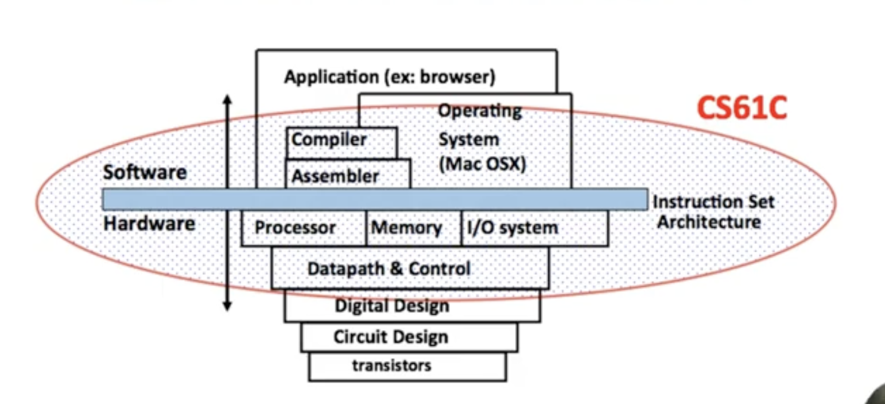

# Course Goals

1. How do computer processors and memories work, and how do they affect software design and performance?
2. Introduction to "computer systems" areas: architecture, compiers, security, embedded, operation systems, large-scale computing

**Six Great Ideas in computer Architecture**

1. Abstraction
2. Technology Trends
3. Principle of Locality/Memory Hierarchy
4. Parallelism 
5. Performance Measurement & Improvement 
6. Dependability via Redundancy 

# Nubmer Representation

## Nubmer Bases 

Computer: Base 2

**Notation:**

1. $9472_{ten} = 9472$
2. $101011_{two} = 0b101011$
3. $2A5D_{hex} = 0x2A5D$

## Signed Prepresnetations

**Sign and magnitude**

3 =  0b0011

-3 = 0b1011

**One's Complement**

 **Two's Complement**

- Most neg number?

  $10...0_{two} = -2^{(n-1)}_{ten}$

- Most pos nubmer?

  $01...1_{two} = (2^{(n-1)}-1)_{ten}$

- One more negative # because positive side has 0

- Can still use MSB sign bit

- **To negate: Flip the bits and add one**

## Overflow

**Numbers in a Computer**

- Usually ignore leading zeros
- Leftmost is most significant bit (MSB)
- Rightmost is least significant bit (LSB)

## Sign Extension

- Want to represent the same number using more bits than before
  - Easy for positive #s (add leading 0's), more complicated for negative #s
  - Sign and magnitude: add 0's after the sign bit
  - One's complement: copy MSB
  - Two's complement: copy MSB

