 ## Switches and Transistors

**Switches**

- The basic element of physical implementations
- Convention: If input is a "1," the switch is **asserted**

AND, OR

Modern digital systems designed in CMOS

- MOS: Metal-Oxide on Semiconductor
- C for complementary: normally-open and normally-closed switches

MOS transistors act as voltage-controlled switches.

## CMOS Networks

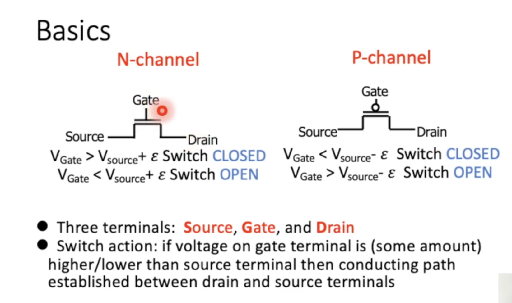

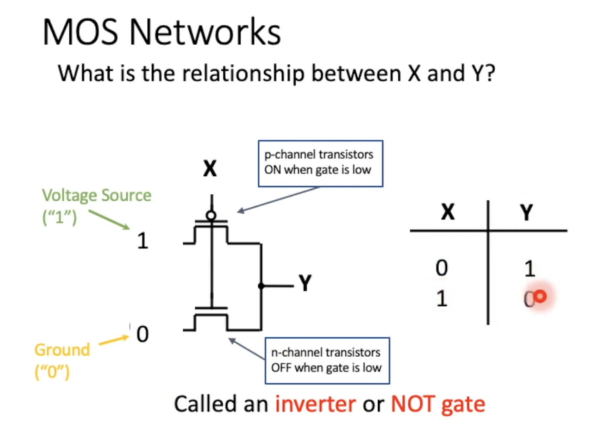

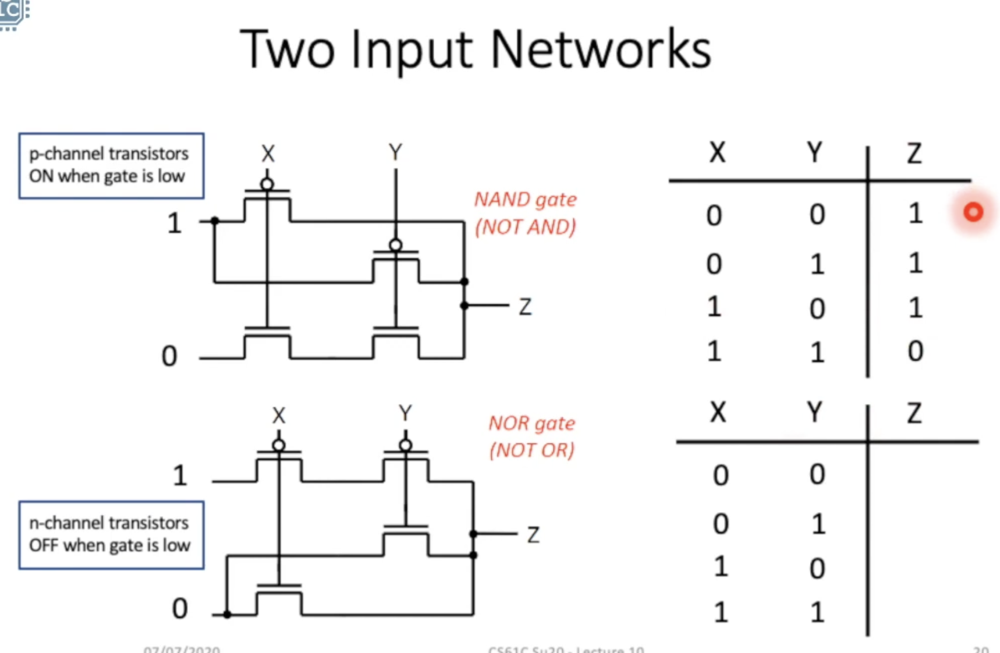

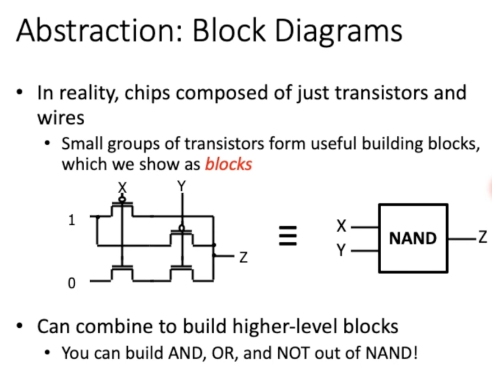

## Combinational Logic

**Combinational Logic Gates**

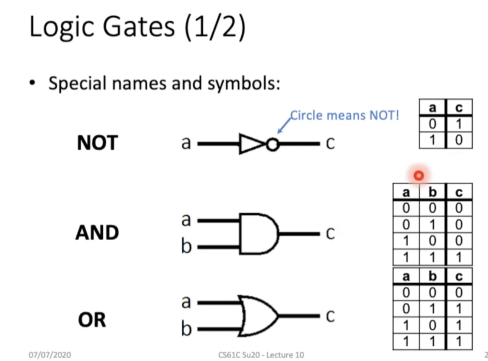

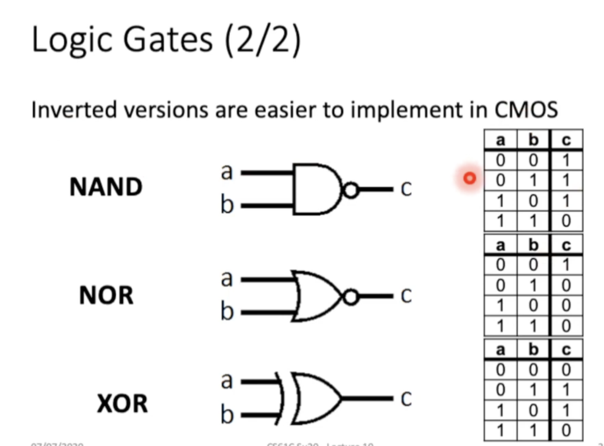

**Truth Tables**

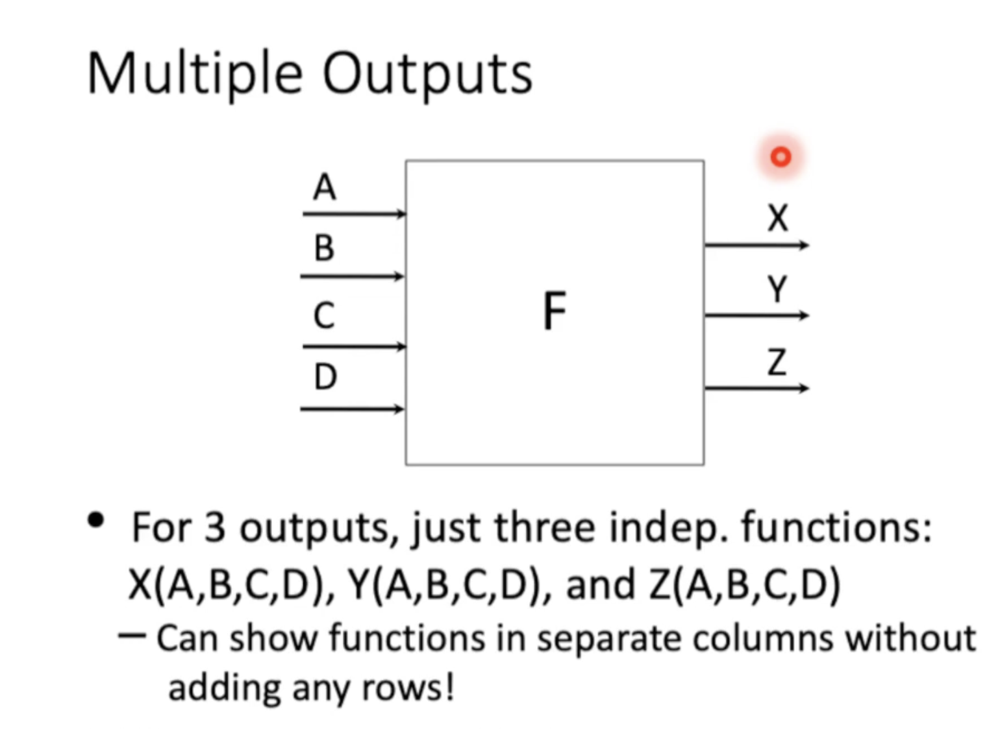

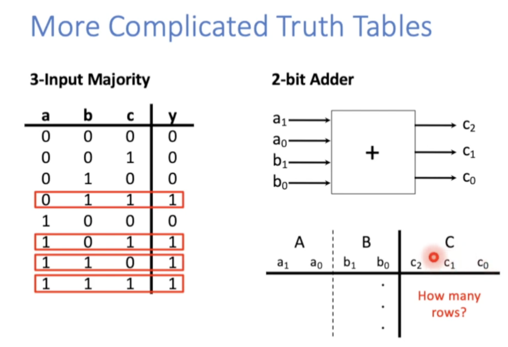

**Boolean Algebra**

Truth tables are huge 

There must be a shorter way to represent combinational logic

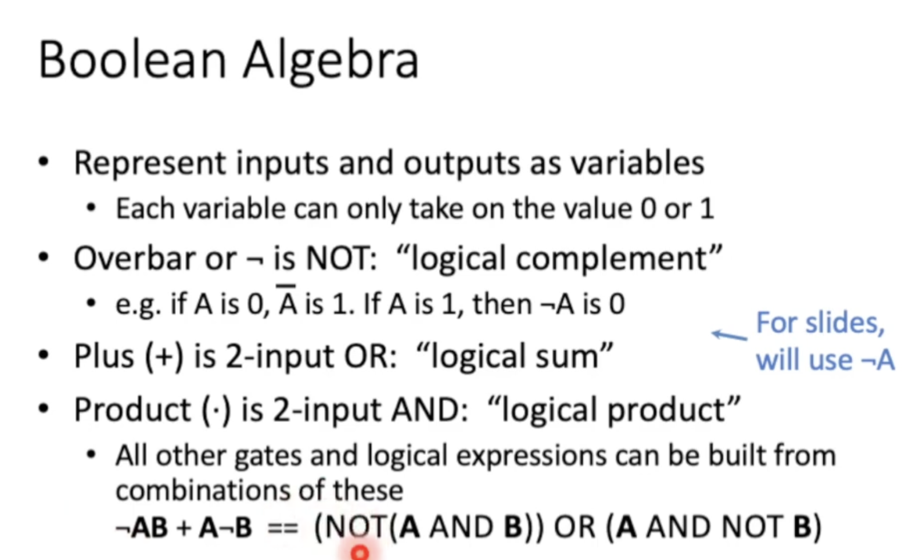

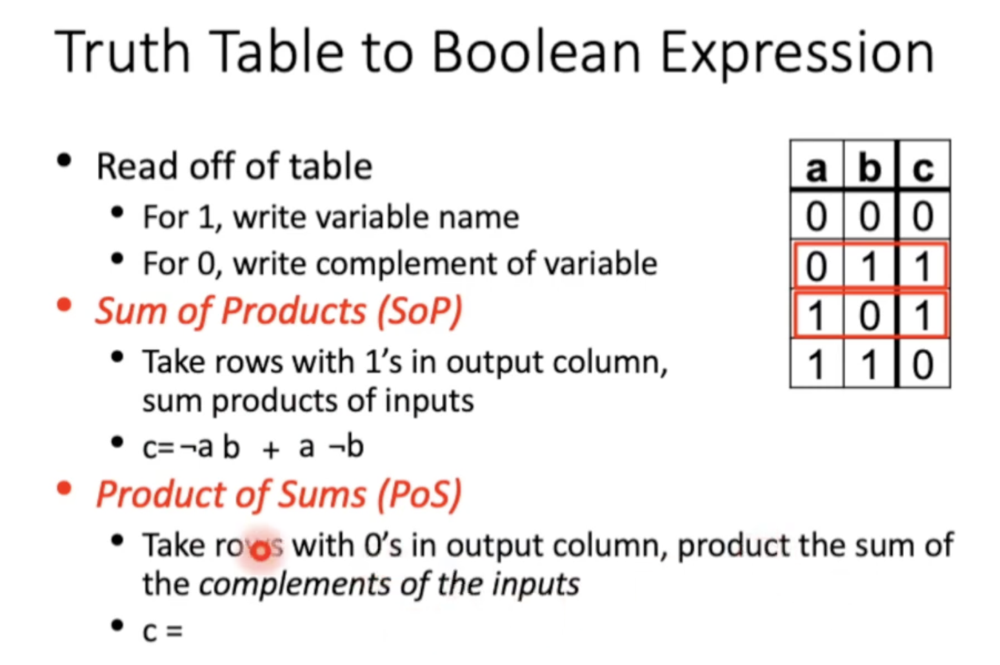

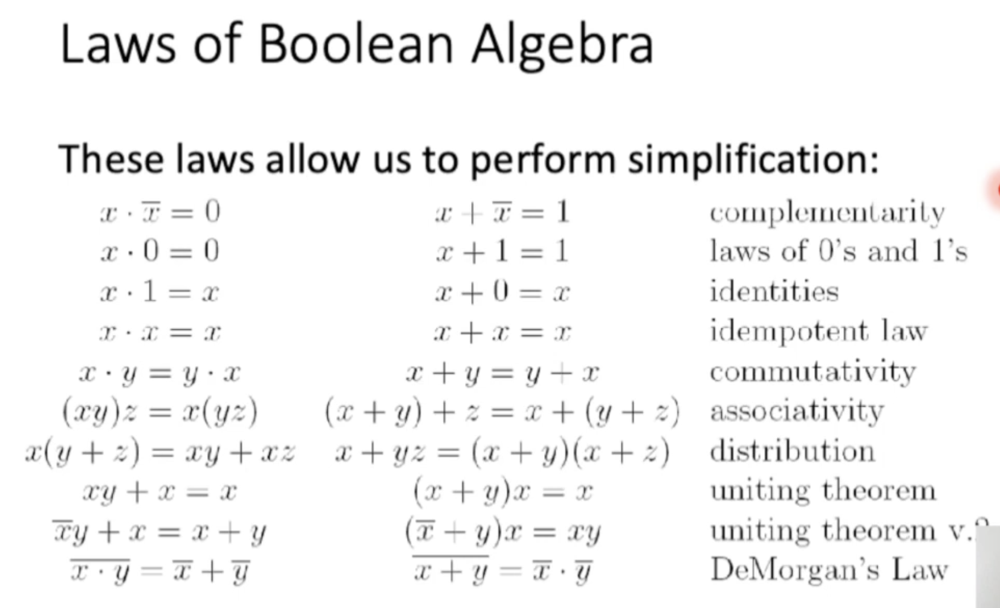

**Circuit Simplification**

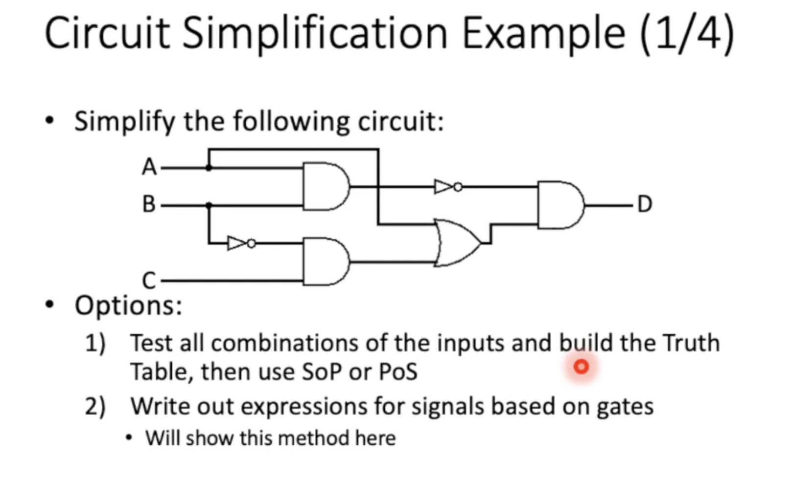

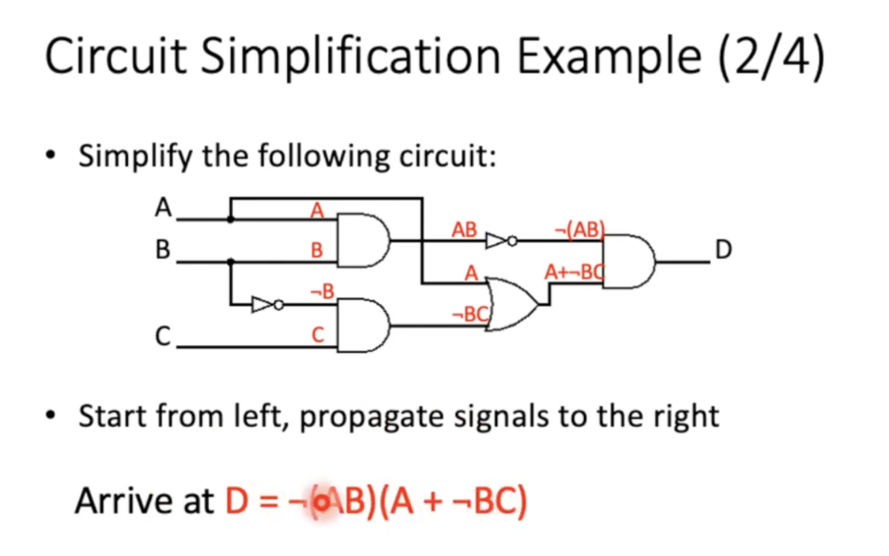

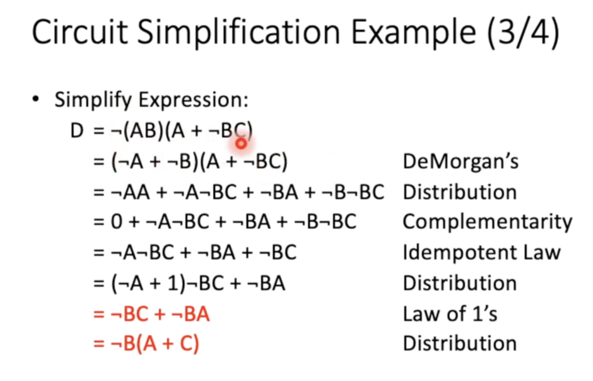

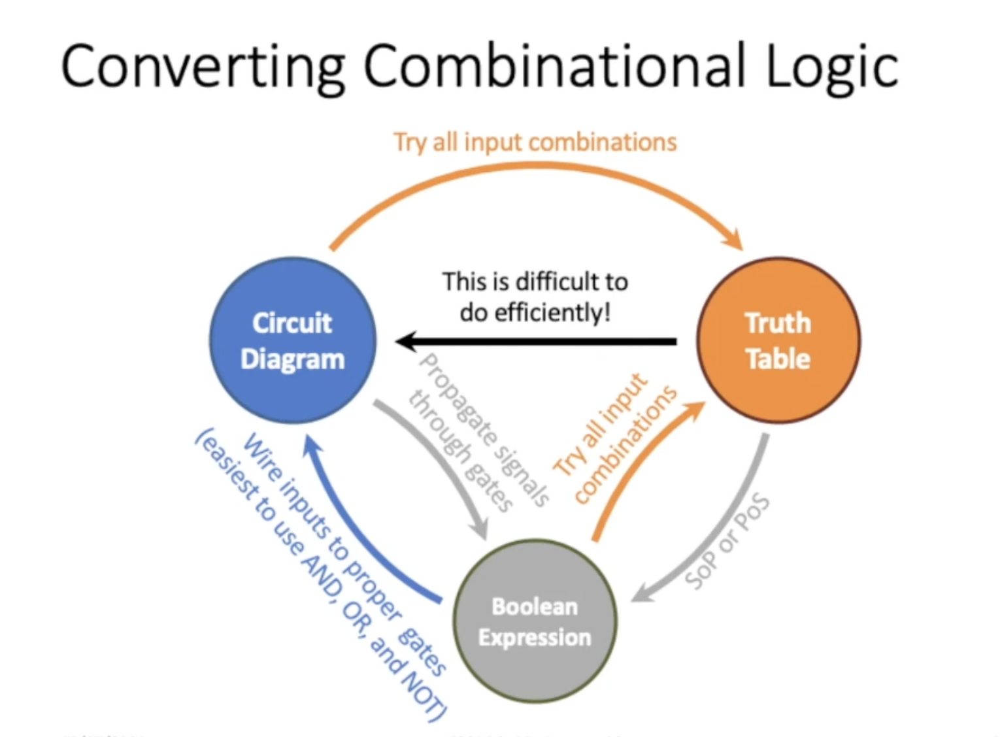