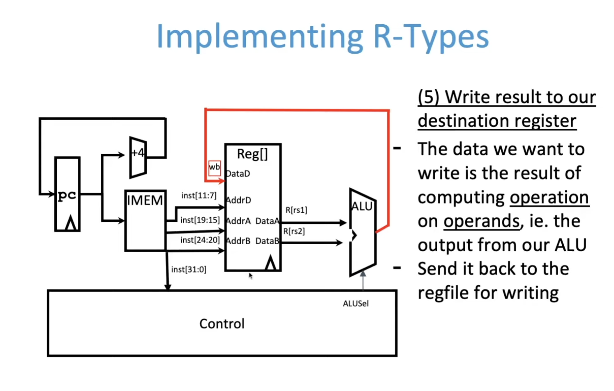
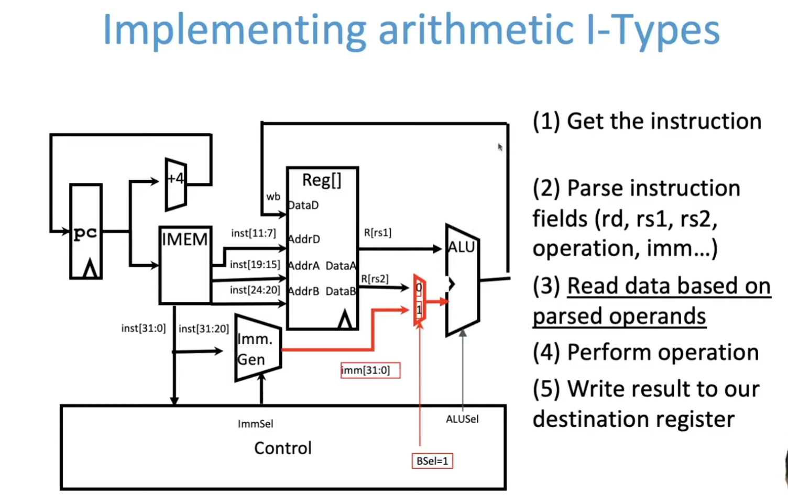
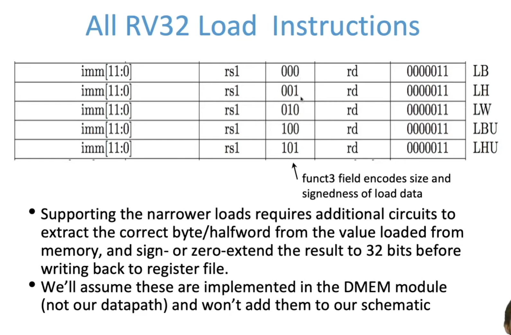

**Today's goal:**

Create a "circuit" of logic elements that, when given an assembly instruction, perform the action the instruction describe

CPU: Central Processing Unit


# What's a CPU?

Your CPU in two parts

- Datapath: contains the hardware necessary to perform operations required by the processor
  - Reacts to what the controller tells it! (Ie. "I was told to do an add, so I'll feed these arguments through an adder")
- Control: decides what each piece of the datapath should do
  - What operation am I performing? Do I need to get info from memory? Should I write to register? Which register? 
  - Has to make decisions based on the input instruction only!


# Building from what we know

## R-Type

```assembly
add a0, a1, a2
```


 

## Arithmetic I-Type

 



## Load I-Type




## S-Type


## SB-Type


## Jumping I-Type

 

## J-Type


# Our CPU


# Processor Design Principles


