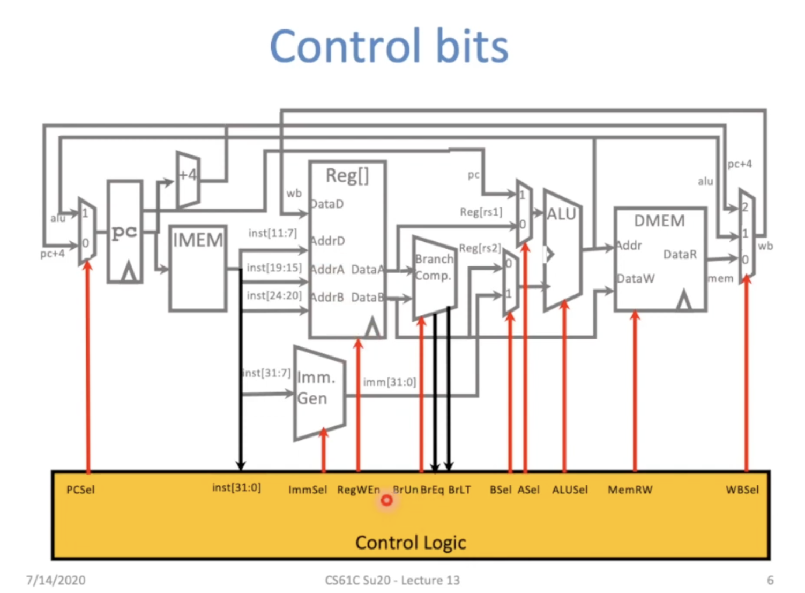
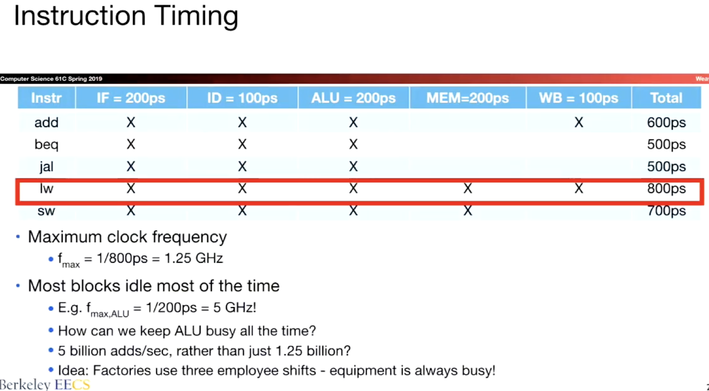
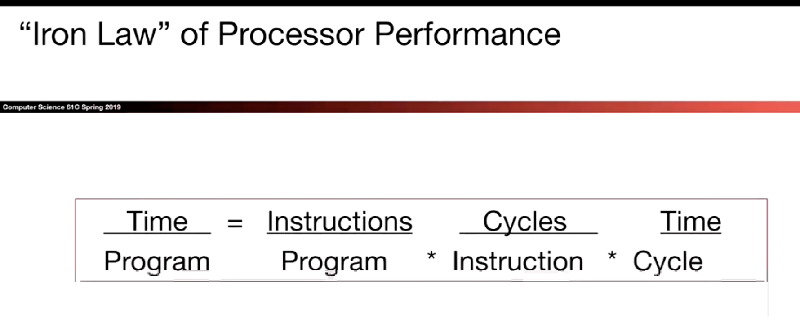
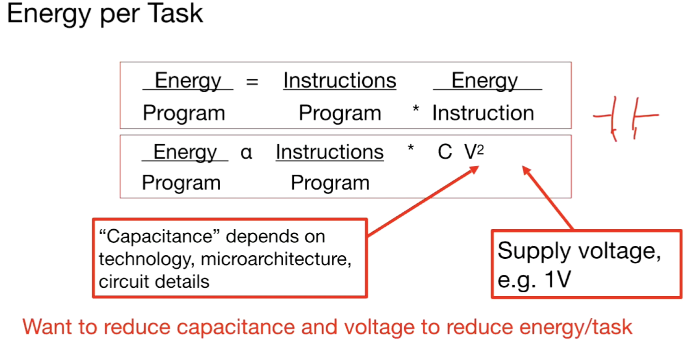
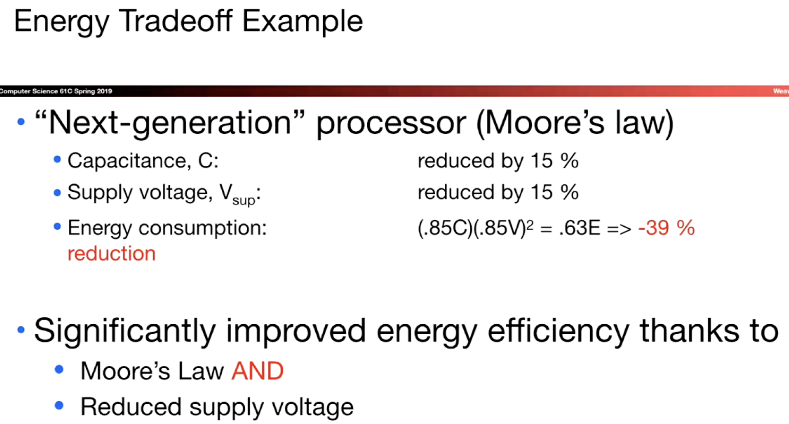
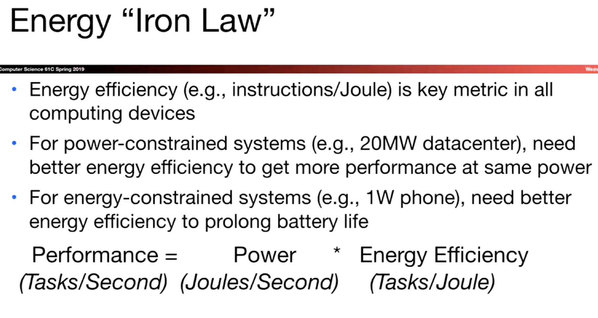
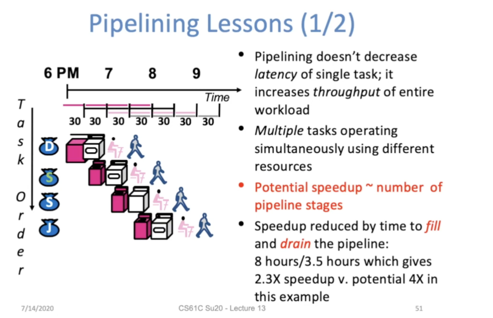
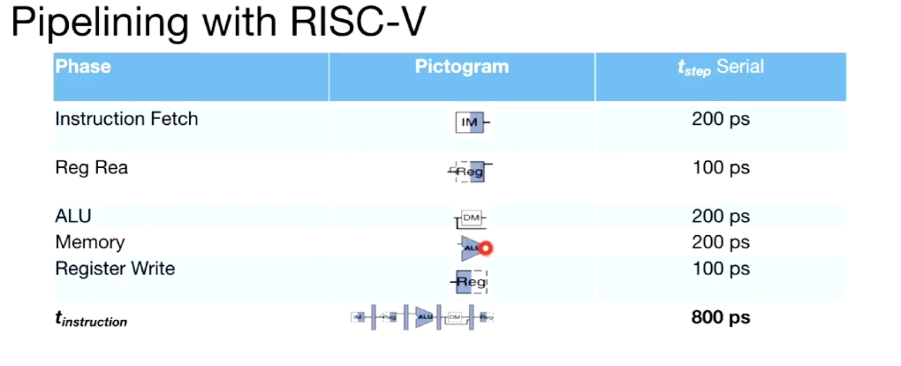
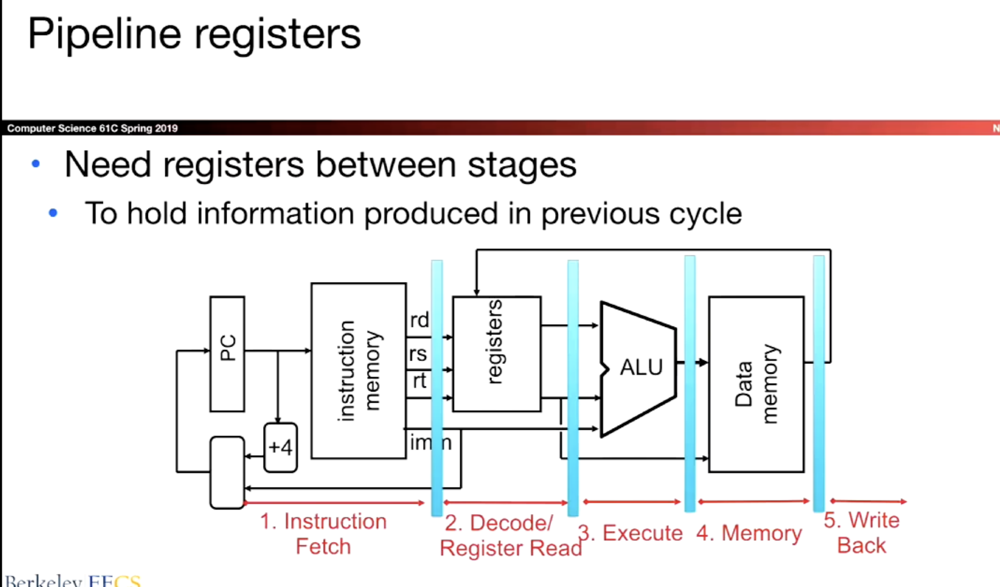
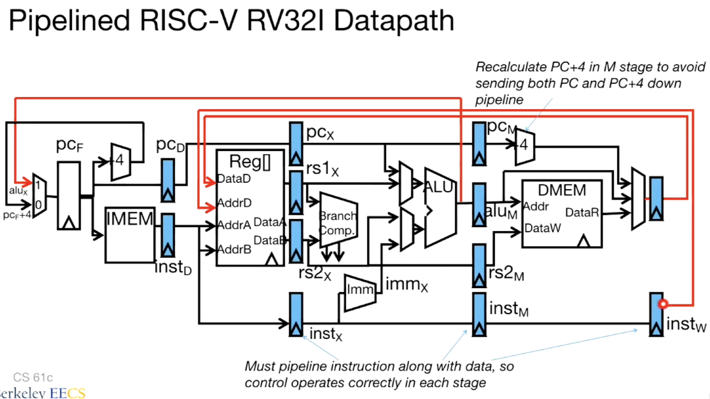

# Control Implementation 

# Performance Analysis

**Instructions per Program**

Determined by Task, Algorithm, Programming language, Compiler, Instruction Set Architecture (ISA)

**(Average) Clock cycles per Instruction**

Determined by ISA, Processor implementation, Superscalar

**Time per Cycle**

Determined by Processor microarchitecture, Technology, Power budget

# Pipelined Execution

# Pipelined Datapath

 