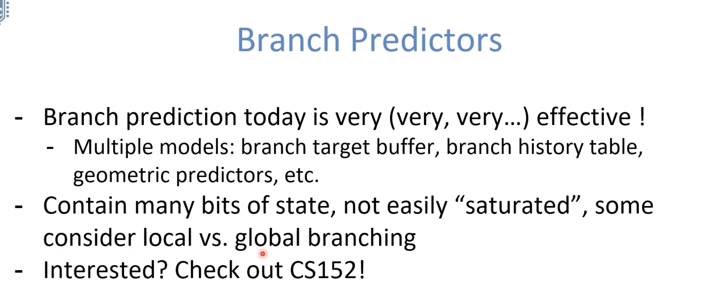

# RISC-V Pipeline

# Hazards

## Structural

**Problem:** Two or more instructions in the pipeline compete for access to a single physical resource

**Solution 1:** Instructions take turns using resource, some instructions have to stall 

**Solution 2:** Add more hardware to machine 

Double Pumping: split RegFile access in two! Prepare to write during 1st half, write on falling age, read during 2nd half of each clock cycle

- Will save us a cycle later
- Possible because RegFile access is very fast (takes less than half the time of ALU stage)

## Data

### R-type instructions

 

### Load

 

## Control

  

 

# Superscalar processors

