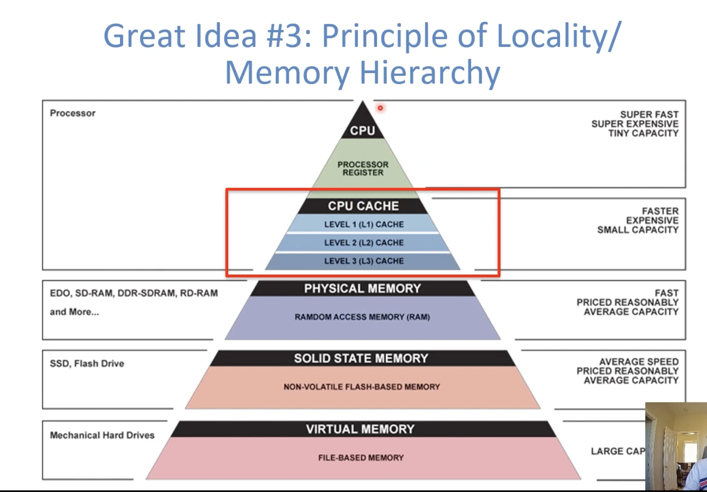
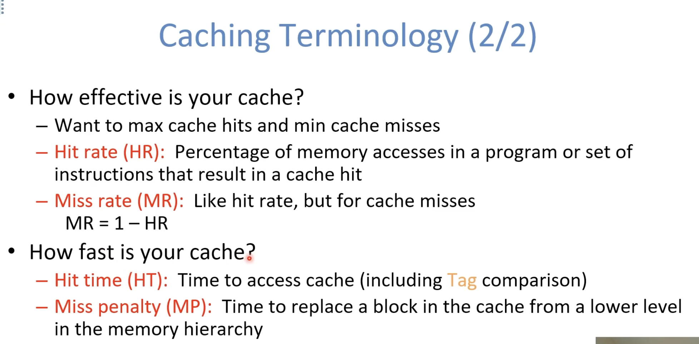

 

**Storage in a Computer**

- Processor
  - Holds data in register files
  - Registers accessed on sub-nanosecond timescale
- Memory
  - More capacity than registers (~GiB)
  - Access time ~ 50-100 ns
- Hundreds of clock cycles per memory access?!

**Processor-Memory Gap**

Add a Cache between Processor and Memory

 

**Principle of Locality**

- Principle of Locality: Programs access only a small portion of the full address space at any instant of time 
  - Recall: Address space holds both code and data
  - Loops and sequential instruction execution mean generally localized code access 
  - Stack and Heap try to keep your data together 
  - Arrays and structs naturally group data you would access together
- Temporal Locality (locality in time)
  - If a memory location is referenced then it will tend to be referenced again soon
- Spatial Locality (locality in space)
  - If a memory location is referenced, the locations with nearby addresses will tend to be referenced soon
- We exploit the principle of locality in hardware via a **memory hierarchy** where:
  - Levels closer to processor are faster 
  - Levels farther from processor are larger 
- Goal: Create the illusion of memory being almost as fast as fastest memory and almost as large as biggest memory of the hierarchy

**Cache Concept**

- Memory Cache - holds a copy of a subset of main memory
  - We often use $("cash") to abbreviate cache 
- Modern processors have separate caches of instructions and data, as well as several levels of caches implemented in different sizes

**Managing the Hierarchy**

- Registers <-> memory
  - By compiler (or assembly level programmer
- Cache <-> main memory 
  - By the cache controller hardware
- Main memory <-> disks (secondary storage)
  - By the OS (virtual memory, which is a later topic)
  - Virtual to physical address mapping assisted by the hardware
  - By the programmer (files)

## Cache Management 

 

## Fully Associative Caches

- Each memory block can map anywhere in the cache (fully associative)
  - Most efficient use of space
  - Least efficient to check
- To check a fully associative cache:
  - Look at All cache slots in sequence
  - If Valid bit is 0, then ignore
  - If Valid bit is 1 and Tag matches, then return that datas

## Hits, Misses, and Replacement Policies

- Cache hit:
  - Cache holds a valid copy of the block, so return the desired data
- Cache miss:
  - Cache does not have desired block, so fetch from memory and put in empty (invalid) slot
    - If cache is full you must discard one valid block and replace It with desired data
    - Which block do you replace?
      - Use a cache block replacement policy 
      - Of note:
        - Random Replacement
        - Least Recently Used (LRU): requires some "management bits"

## Cache Reads and Writes

 

 

