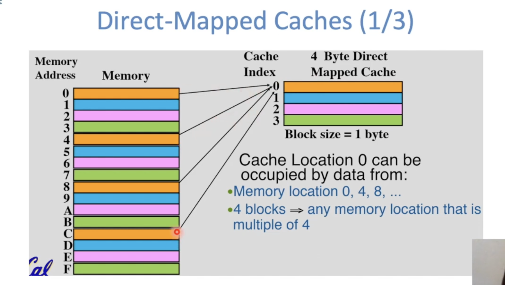
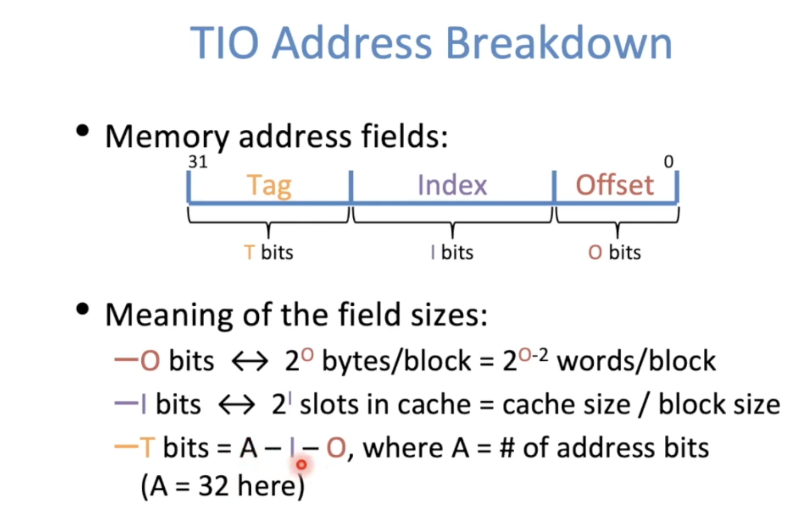
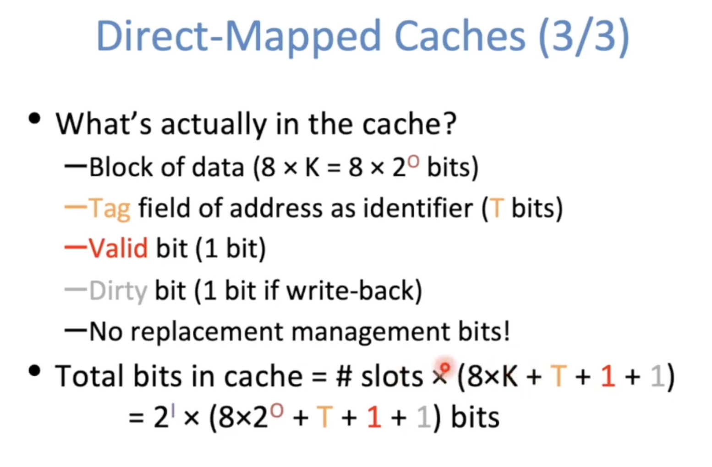
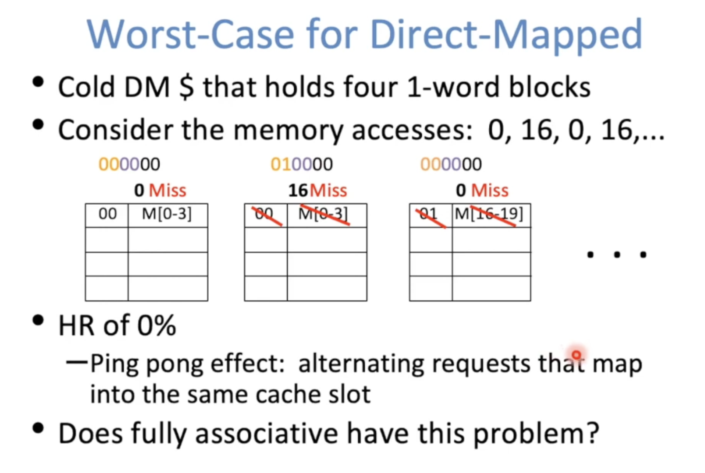
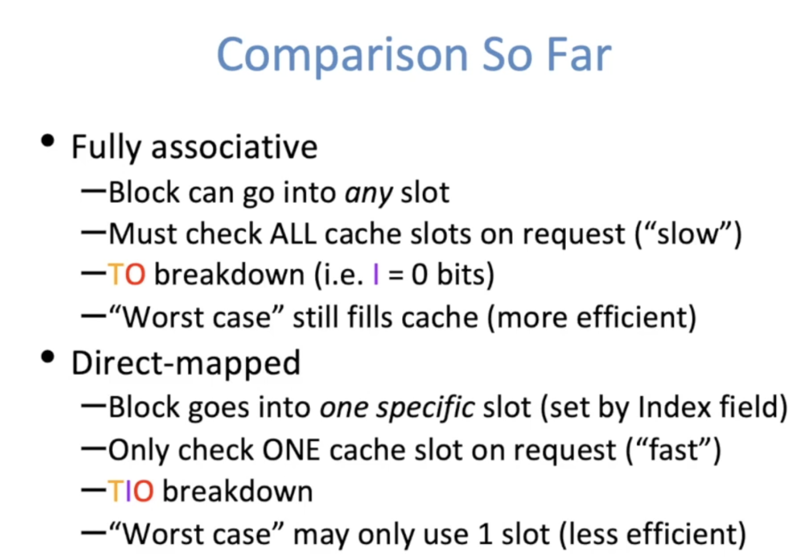
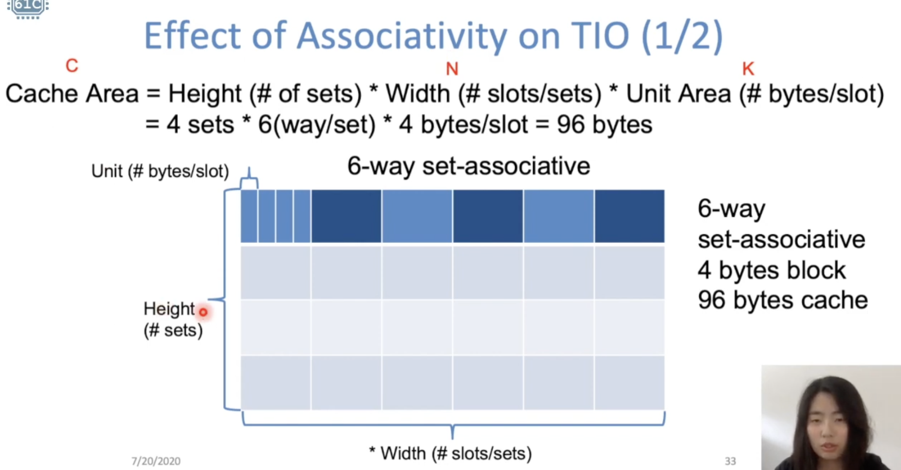

**Write Hits**

- Wirte-Through Policy
- Write-Back Policy 
  - Dirty bit

**Write misses**

- Write Allocate (paired with write-back)
- No Write Allocate policy (paired with write-through)

## Direct-Mapped Caches

- Each memory block is mapped to exactly one slot in the cache (direct-mapped)
  - Every block has only one "home"
  - Use hash function to determine which slot
- Comparison with fully associative
  - Check just one slot for a block (faster)
  - No replacement policy necessary 
  - Access pattern may leave empty slots in cache

## Set Associative Caches

`N-way set-associative`: Divide $ into sets, each of which consists of N slots

- Memory block maps to a set determined by index field and is placed in any of the N slots of that set 
- Call N the associativity
- Replacement pollicy applies to every set

