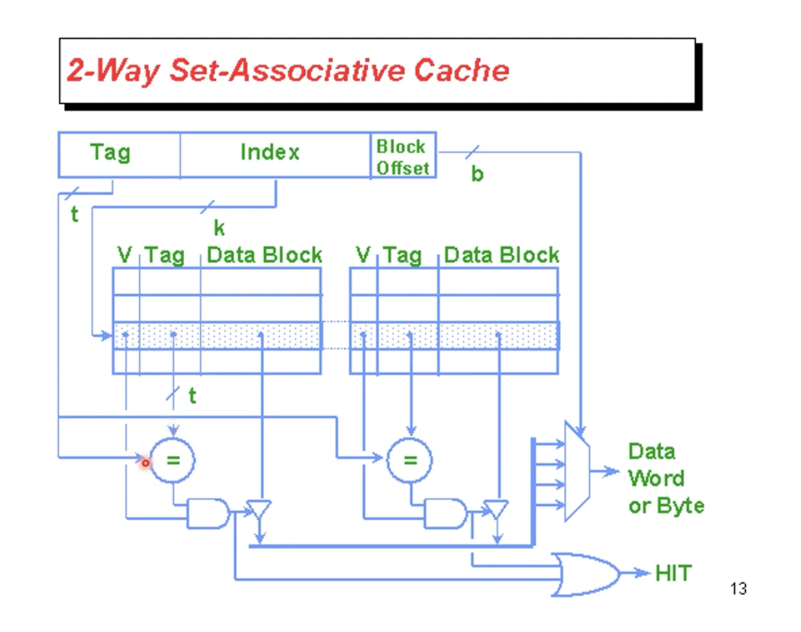
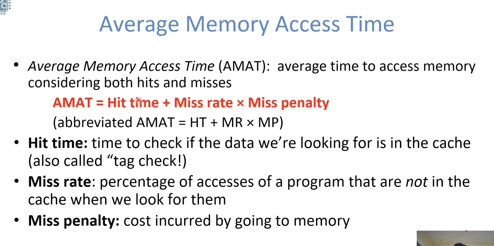
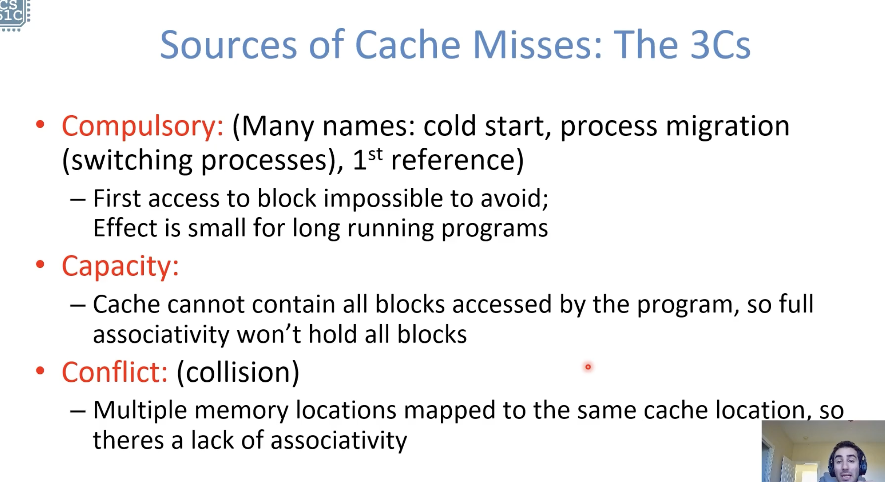
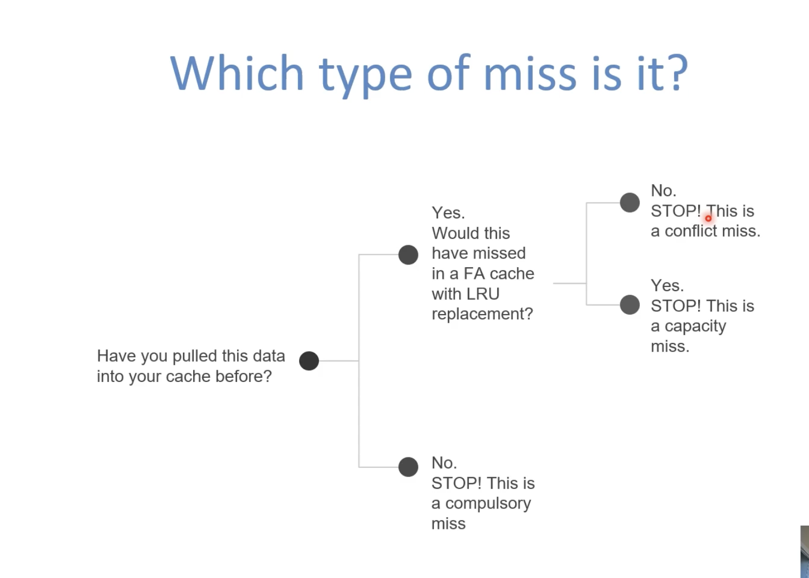
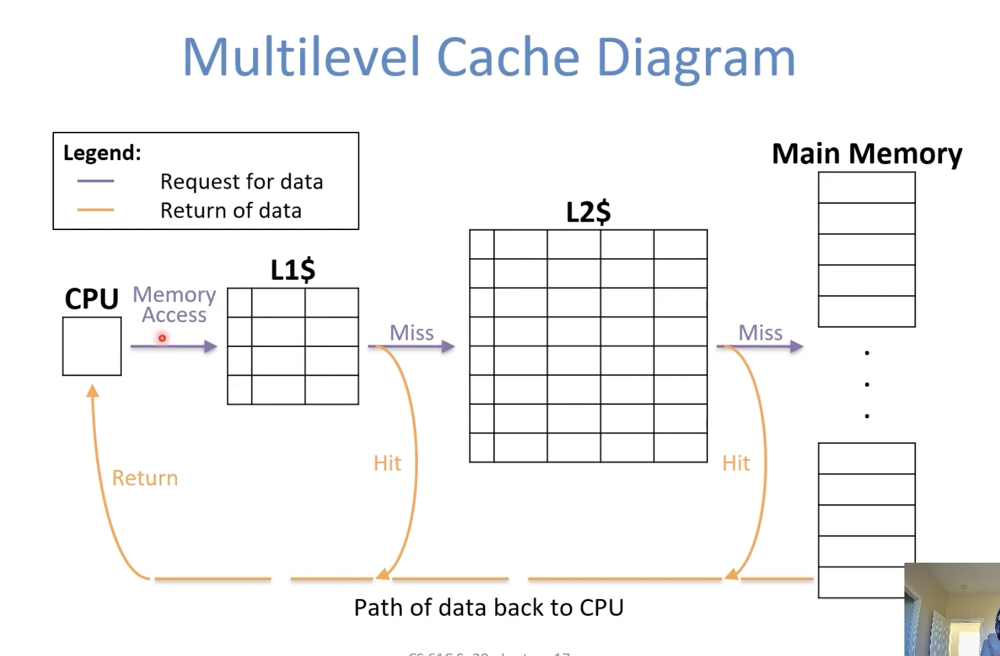
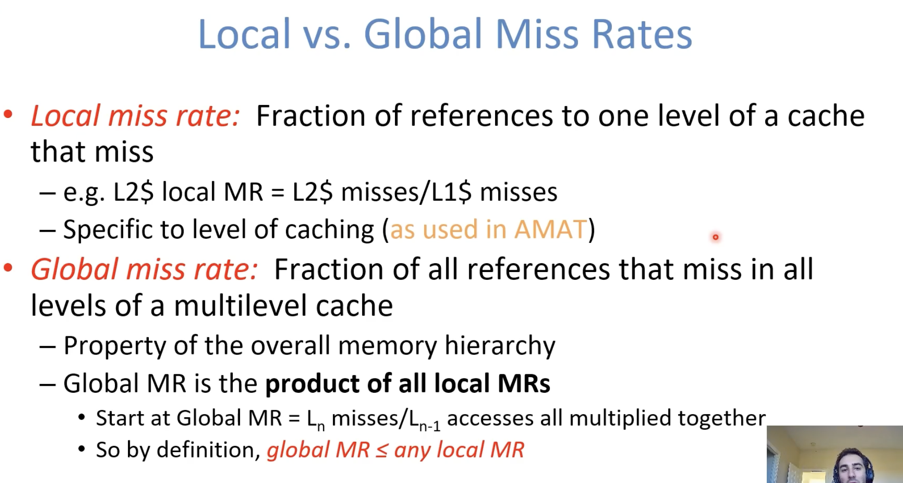
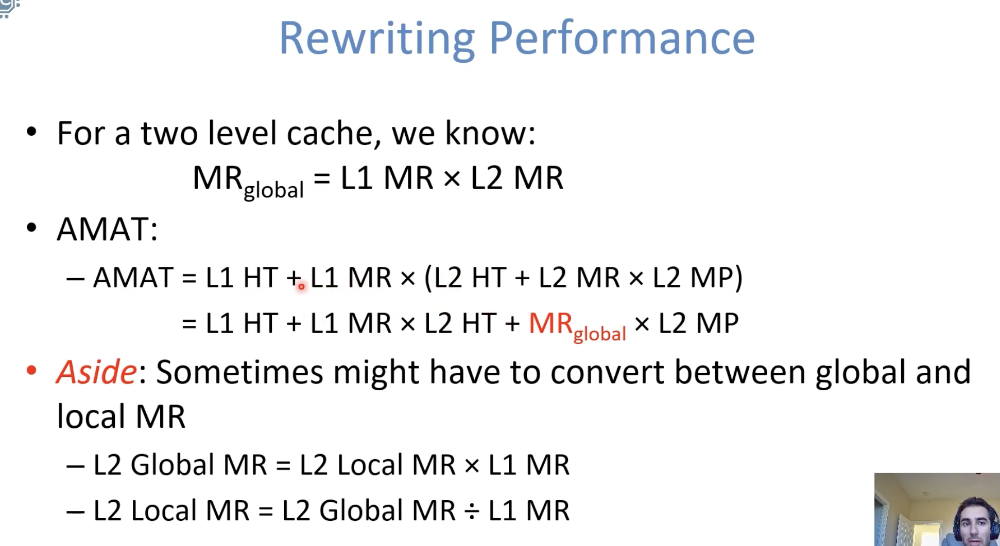
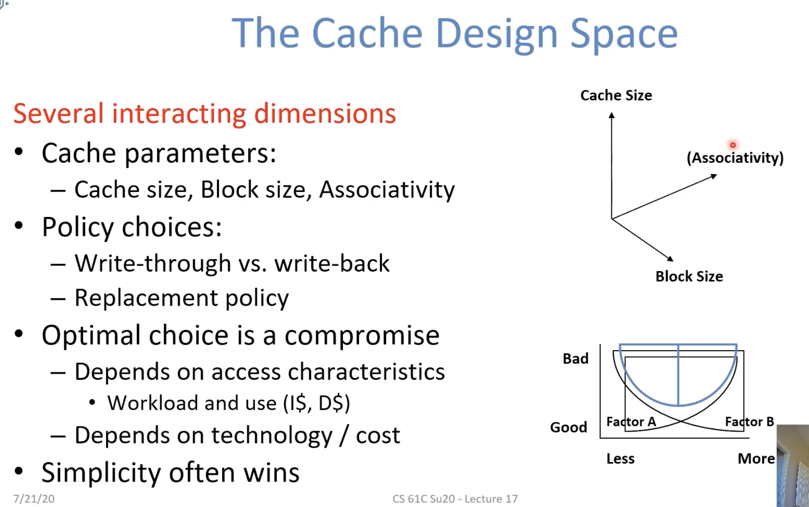
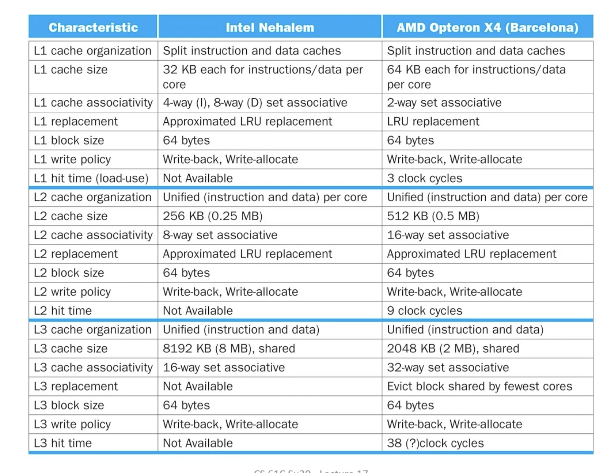

  

# AMAT

**Hit Time**

Cache size decreases -> hit time decrease

Can do tag comparisons in parallel, but requires more hardware (costly) that is more complex (slower)

**Miss Rate**

Access pattern in your program

Block/cache size,  type

Reducing misses

**Miss Penalty**

How "big" is your memory hierarchy?

​	Smaller block size -> lower MP

# Multilevel Caches

 

# Improving Cache Performance

 

