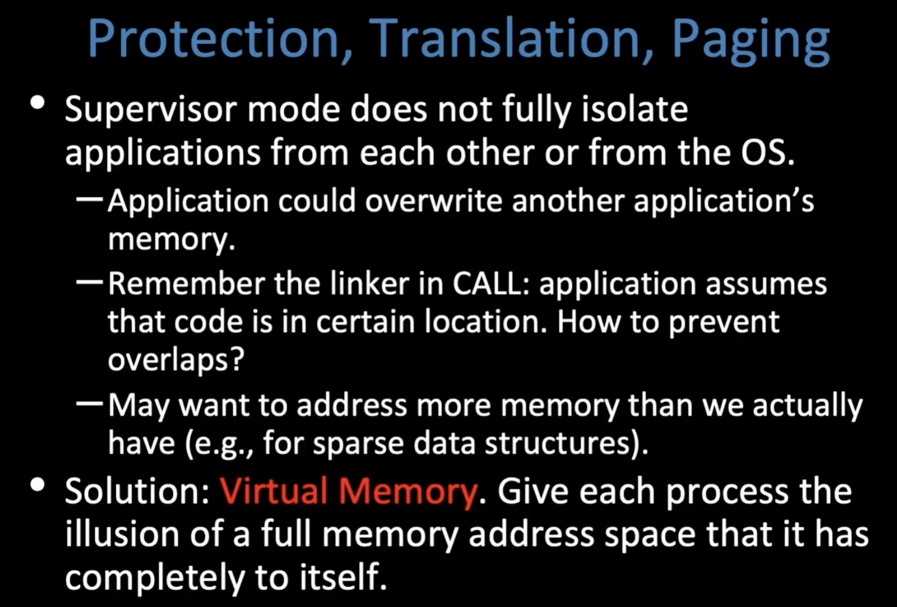
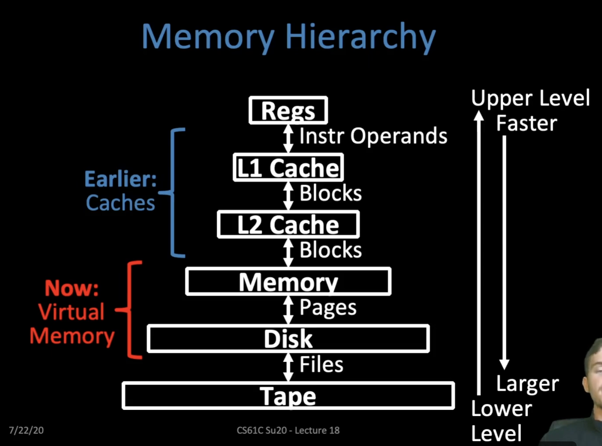
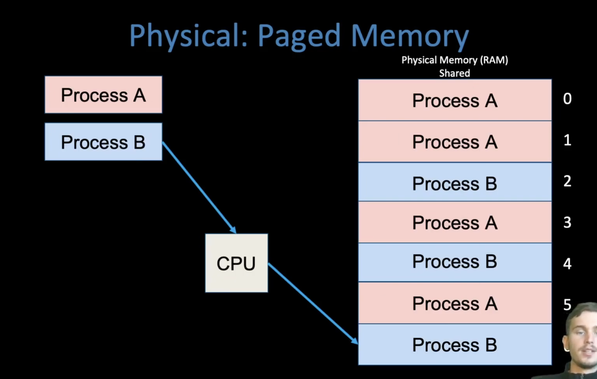
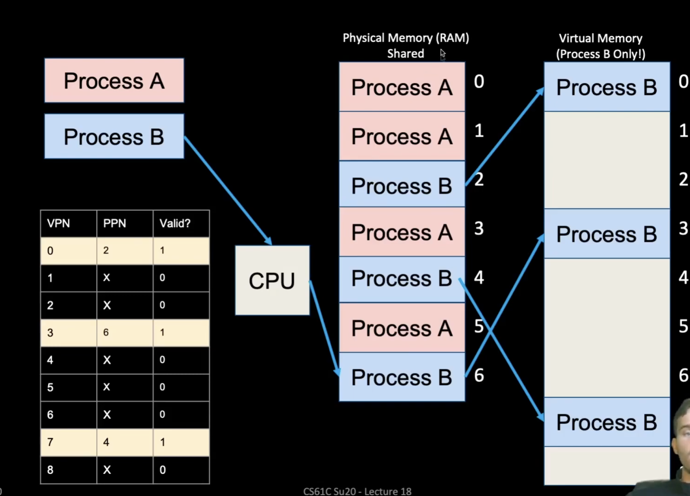
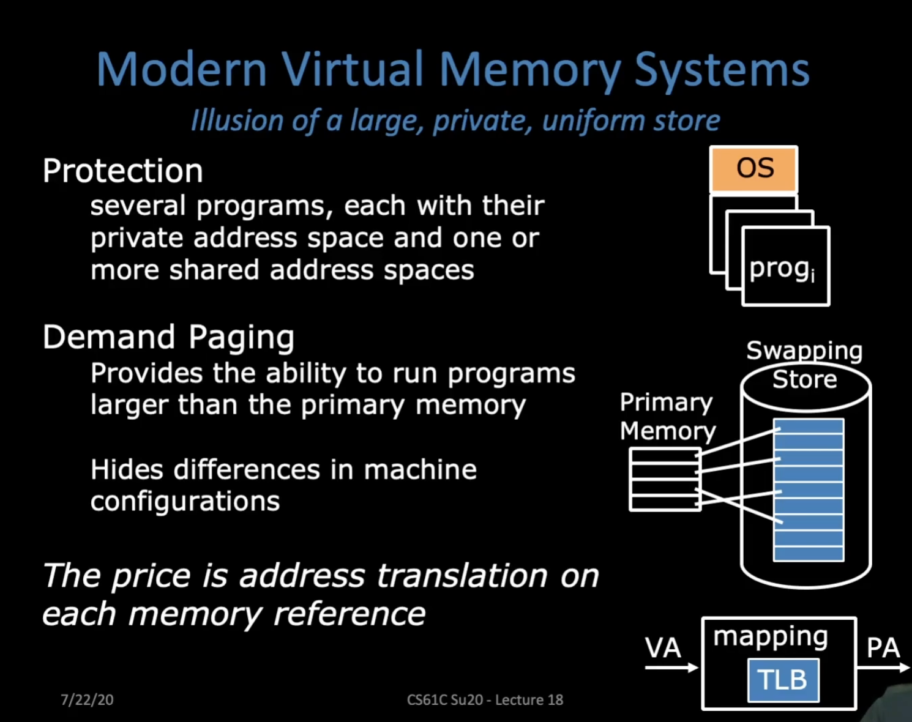

# OS Intro

What does the OS do?

- One of the first things runs when your computer starts
- Loads, runs and manages programs:
  - Multiple programs at the same time (time-sharing)
  - Isolate programs from each other (isolation)
  - Multiplex resources between applications 
- Services: Files System, Network stack, etc
- Finds and controls all the devices in the machine in a general way (using "device drivers")

# OS Boot Sequence and Operation

When the computer switches on, it does the same as Venus: the CPU executes instructions from some start address (stored in Flash ROM)

1. BIOS: Find a storage device and load first sector (block of data)
2. Bootloader (stored on, e.g., disk): Load the OS kernel from disk into a location in memory and jump into it 
3. OS Boot: Initialize services, drivers, etc.
4. Init: Launch an application that waits for input in loop

**Paged Memory**

- Instead of having segments of various sizes, let's divide physical memory and virtual memory into equal units called pages!
  - Pages are all the same size, regardless of program, and RAM is an integer multiple of pages.
  - Page size if the same in both virtual and physical memory
- What does our memory layout look like now?

**Page protection: Page tables!**

- Per program, maintain a list of pages in physical memory that they own 
  - For each page, note the data it contains 
    - Sufficient to just note virtual page number! This will tell us the range of addresses!
- Just like base and bound: use this table to translate addresses so programs cannot reach physical addresses outside of their assigned range!

