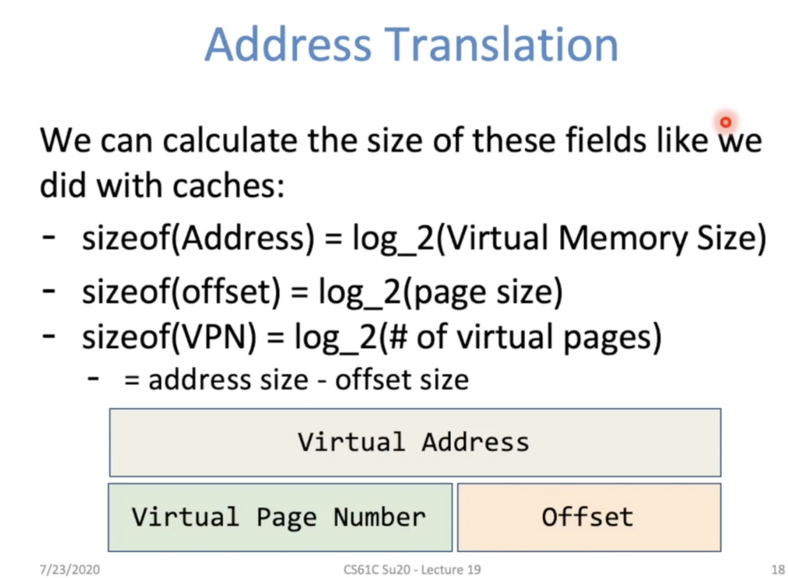
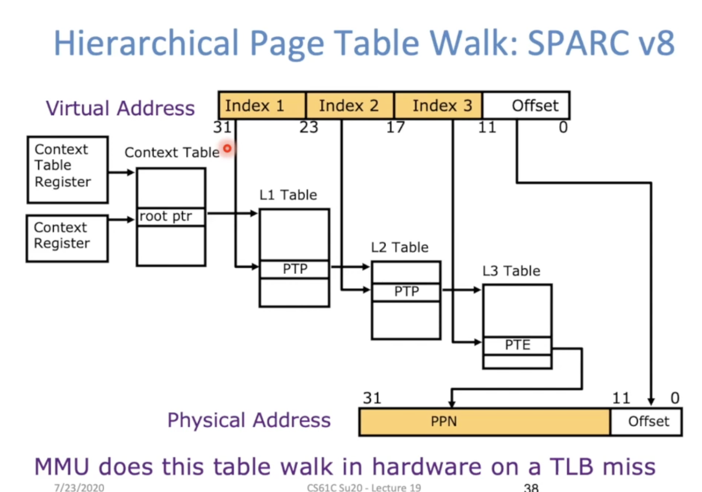
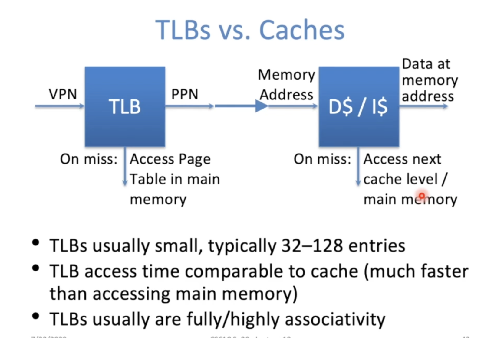

**Virtual Memory**

**Address Space**

# Address Translation

Given a request for an address (virtual) we have to locate the data in physical memory.

The process of converting a virtual address to a physical address is called address translation!

 

**Page Table Entry Format**

- Contains either PPN or indication not in main memory
- Dirty = Page has been modified recently
- Valid = Valid page tale entry
  - 1 -> virtual page is in physical memroy
  - 0 -> OS needs to fetch page from disk Page Fault
- Access Rights checked on every access to see if allowed 
  - Read
  - Write 
  - Executable: Can fetch instructions from page
  - Protection Fault

Build a separate cache for the page table

- For historical reasons, cache is called a Translation Lookaside Buffer (TLB)
- Notice that what is stored in the TLB is NOT memory data, but the VPN -> PPN mappings

 

