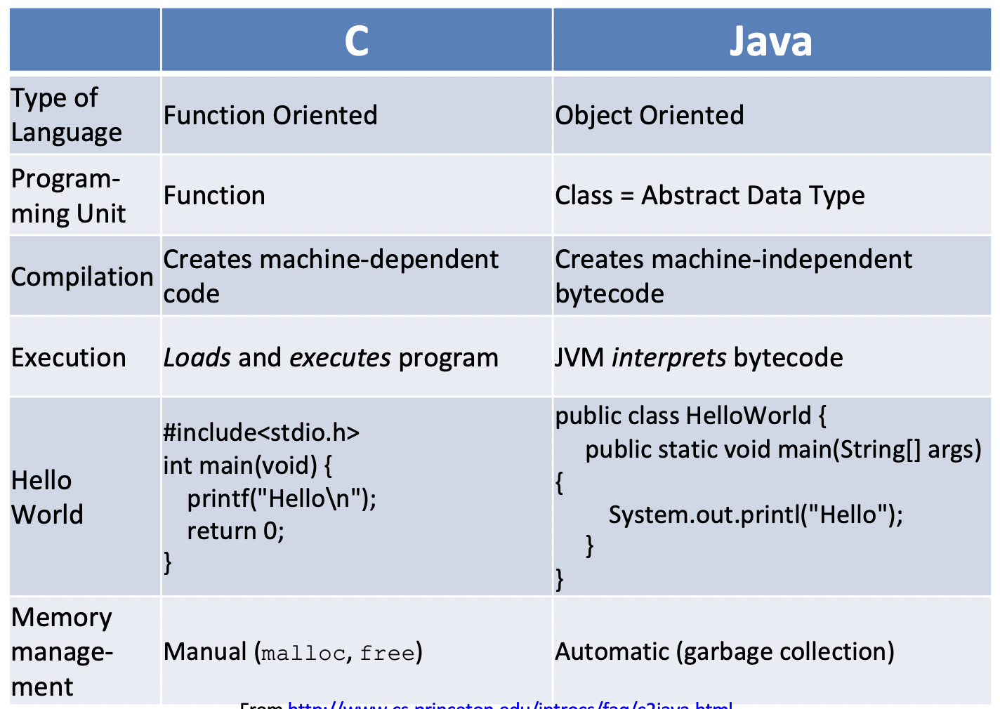
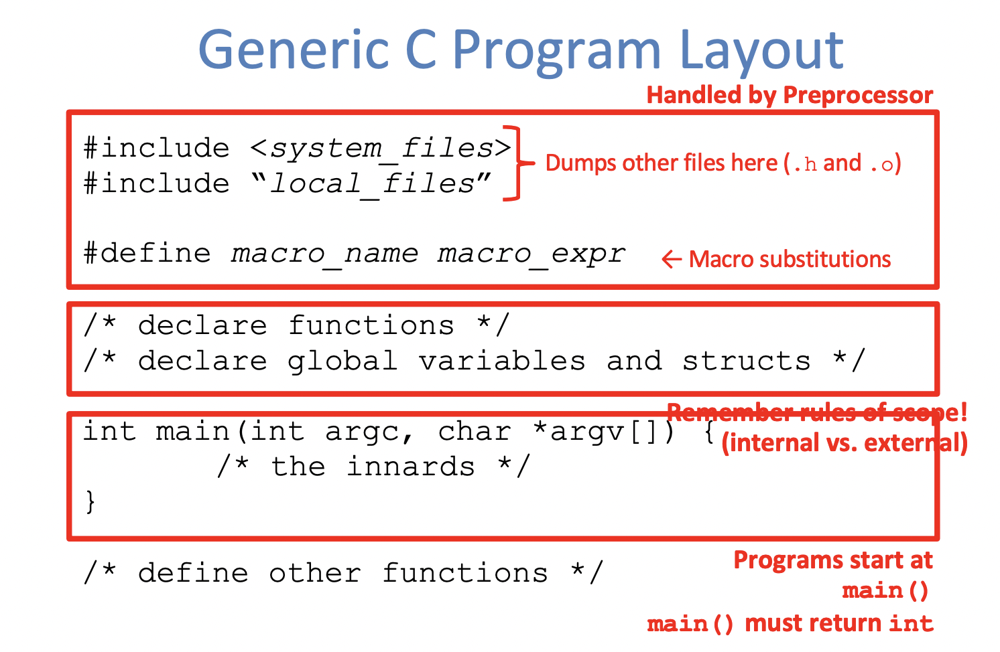

# Basic C Concepts

## Complilation

C is a compiled language

- Execellent run-time performance
- Fair compilation time: enhancements in compilation procedure (Makefiles) allow us to recompile only the modified files

## Variable Types

**Unions in C**

```c
union foo {
  int a;
  char b;
  union foo *c;
}
// provides enough space for the largest element
```



# C Syntax and Control Flow



We use "C99" or "C9x" std

Use option "gcc -std=c99" at compilation

**Highlights:**

- <inttypes.h> for explicit integer types
- <stdbool.h> for boolean logic definition

# Pointers

Careful