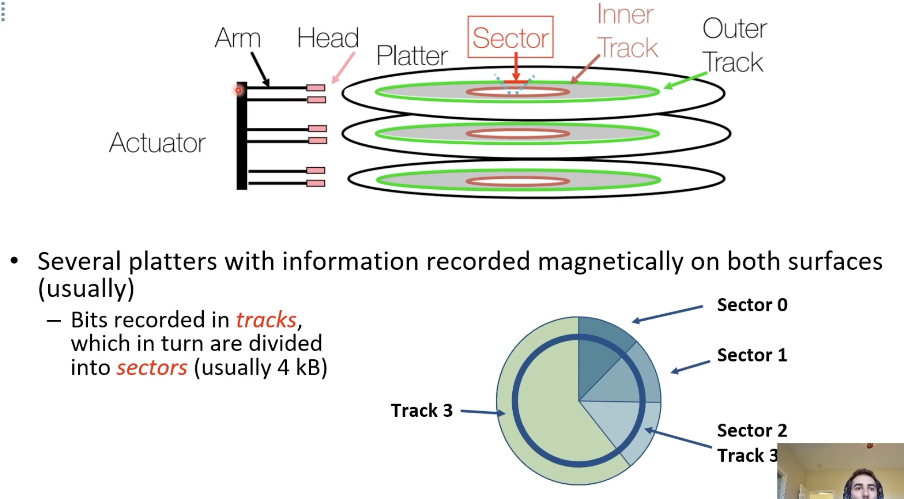
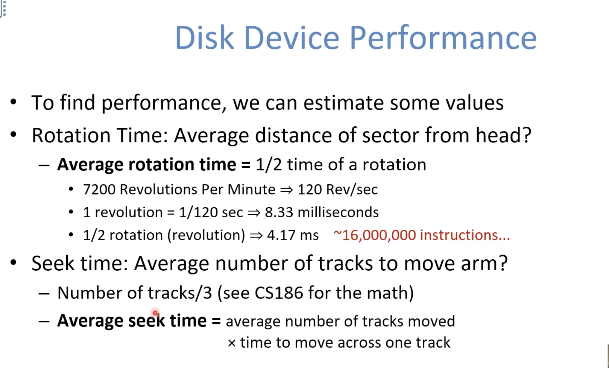
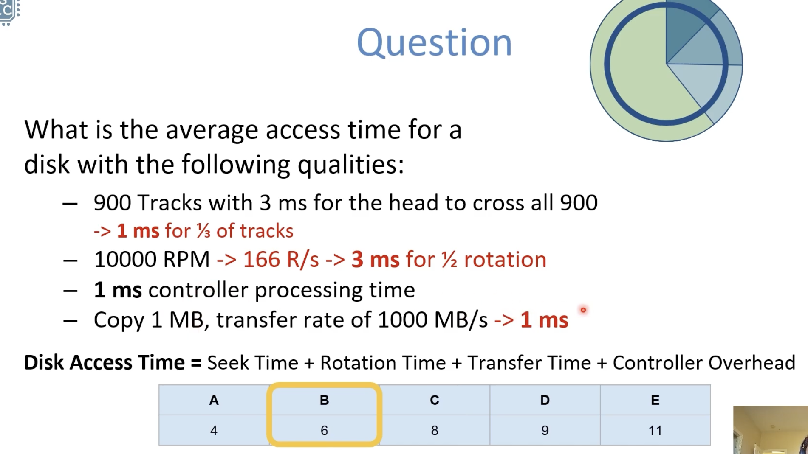
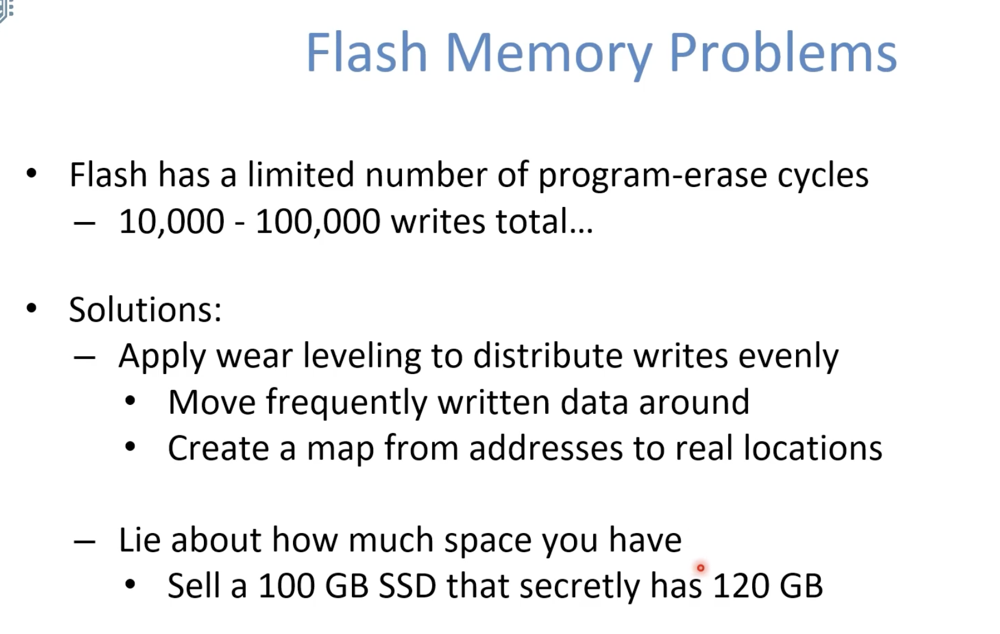
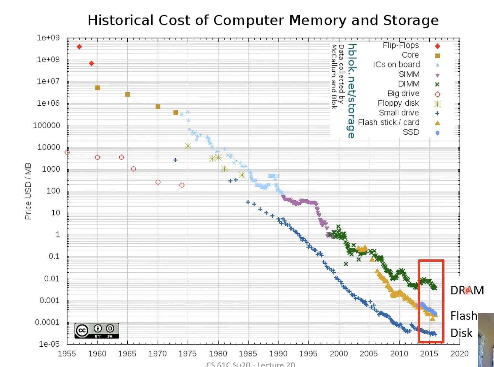
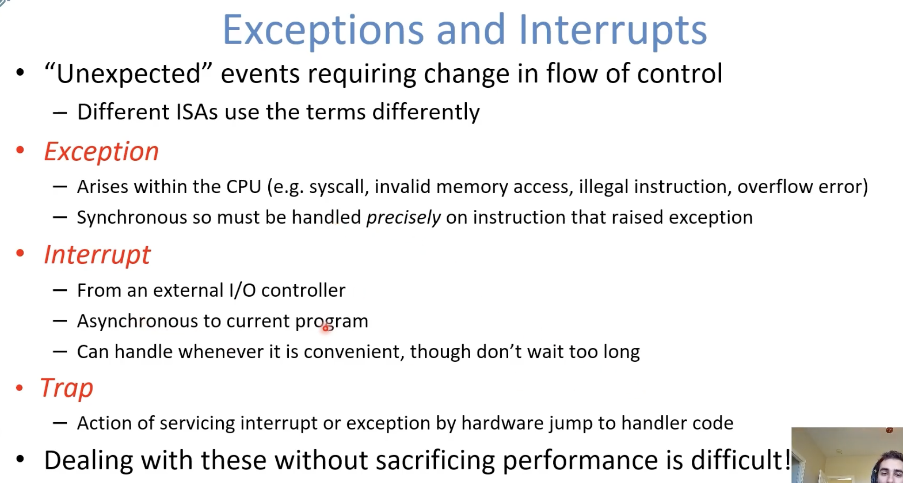
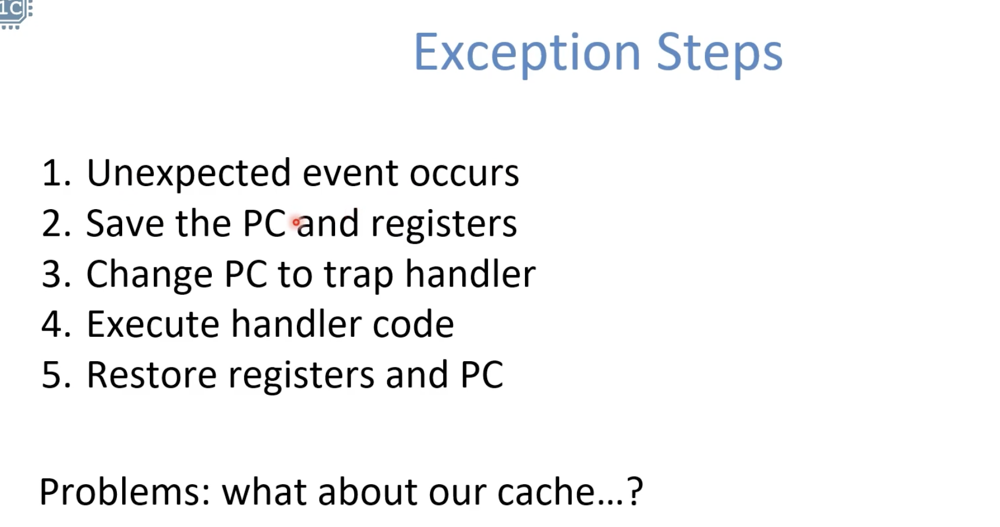
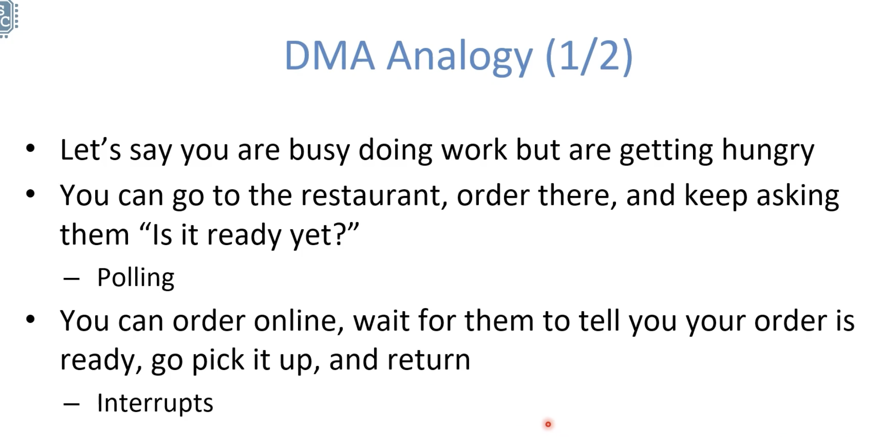
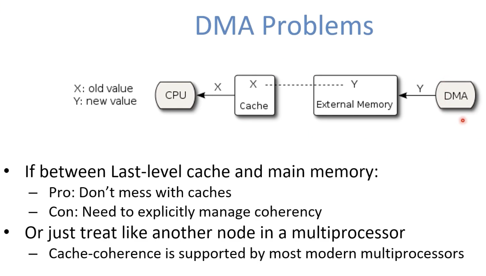

# Input/Output Overview

# Input/Output Devices

Disks are I/O

**Disks** 

  

 

 

# Communicating with Memory-Mapped I/O

**Polling**

 

**Interrupts**

Use exception mechanism to help trigger I/O, then interrupt program when I/O is done with data transfer

**DMA**

