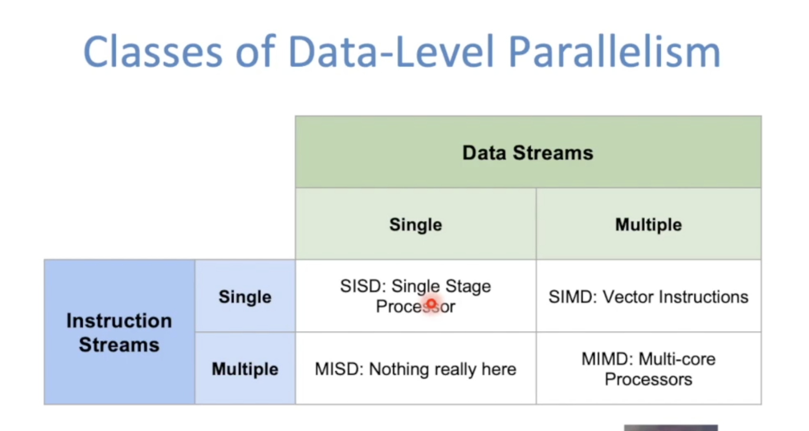
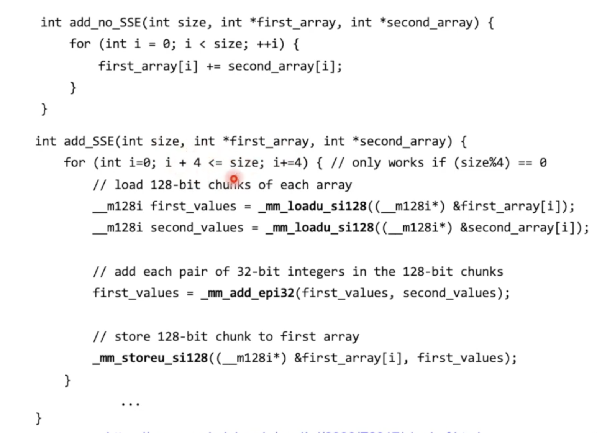
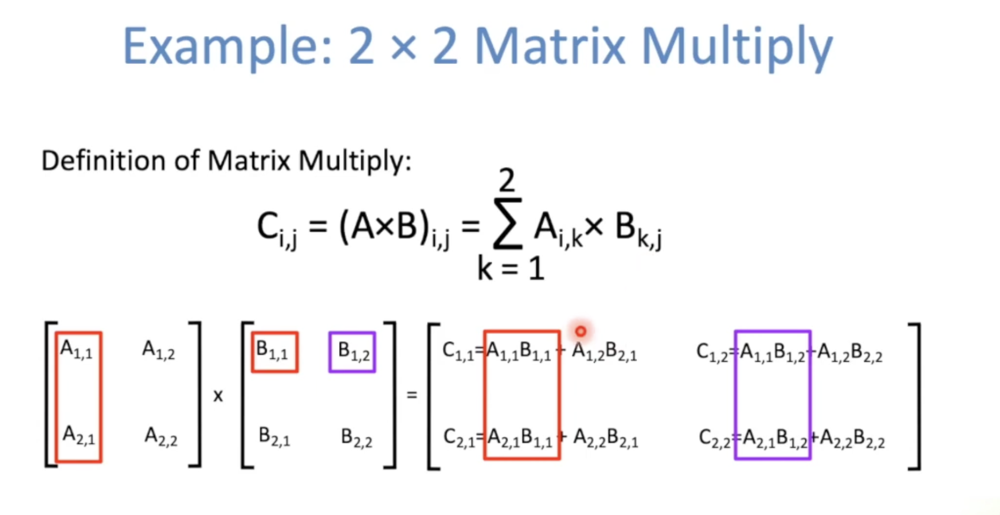

**Intel SSE Intrinsics**

- Intrinsics are C functions and procedures that translate to assembly language, including SSE instructions

  - With intrinsics, can program using these instructions indirectly
  - One-to-one correspondence between intrinsics and SSE instructions

  

