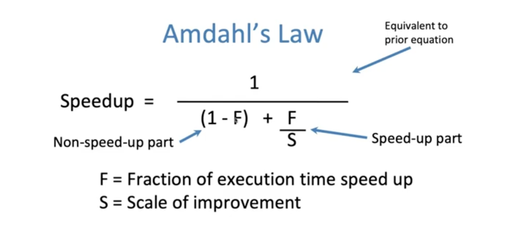
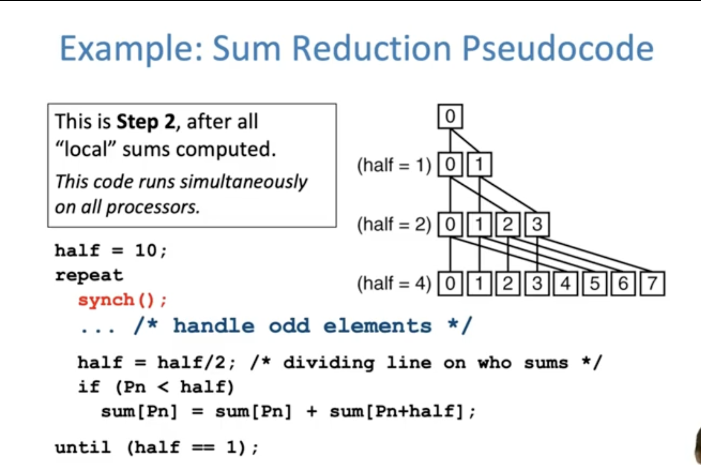
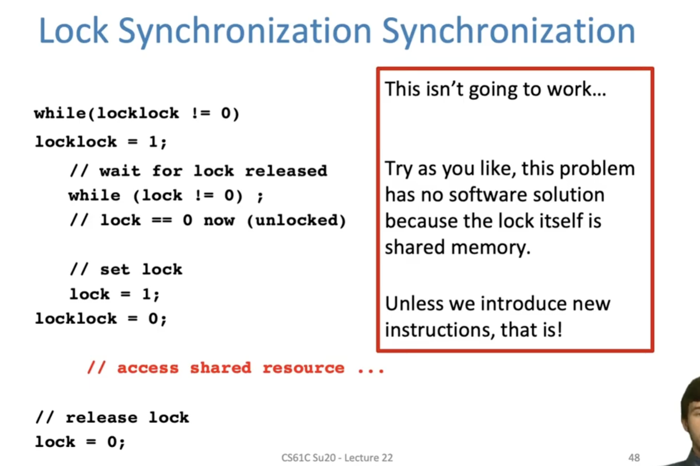
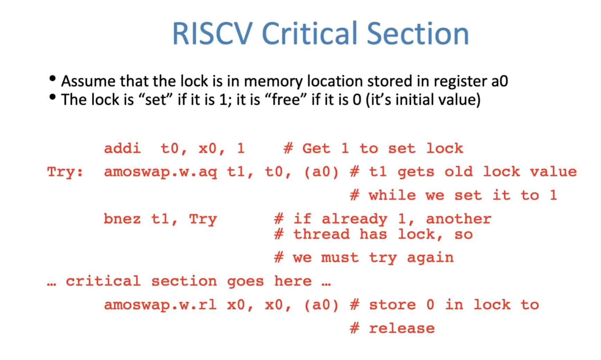
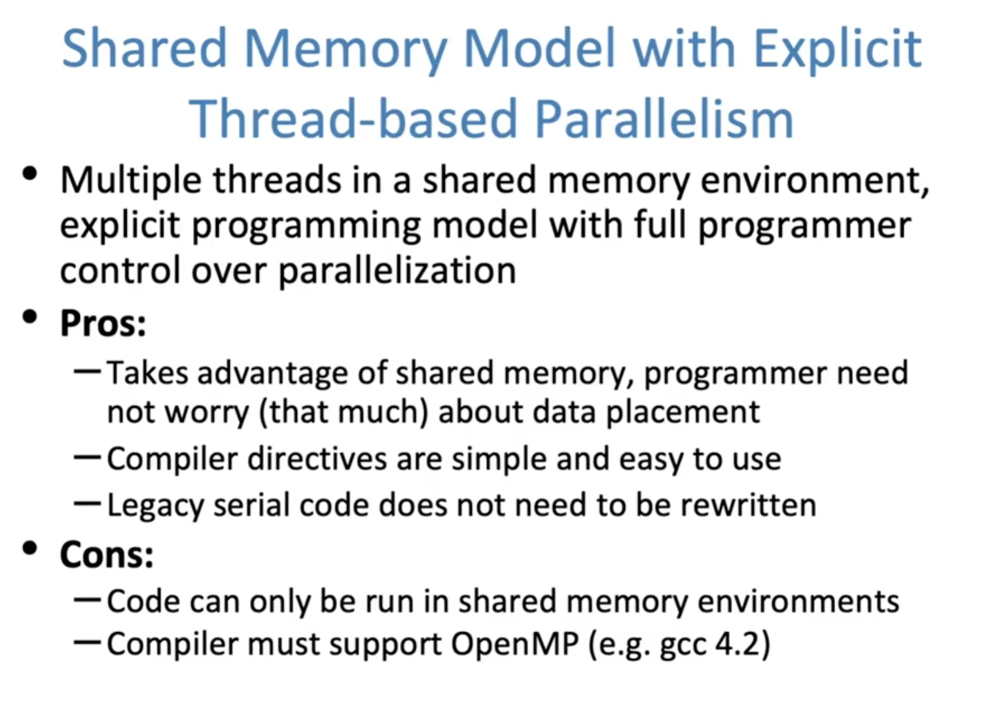
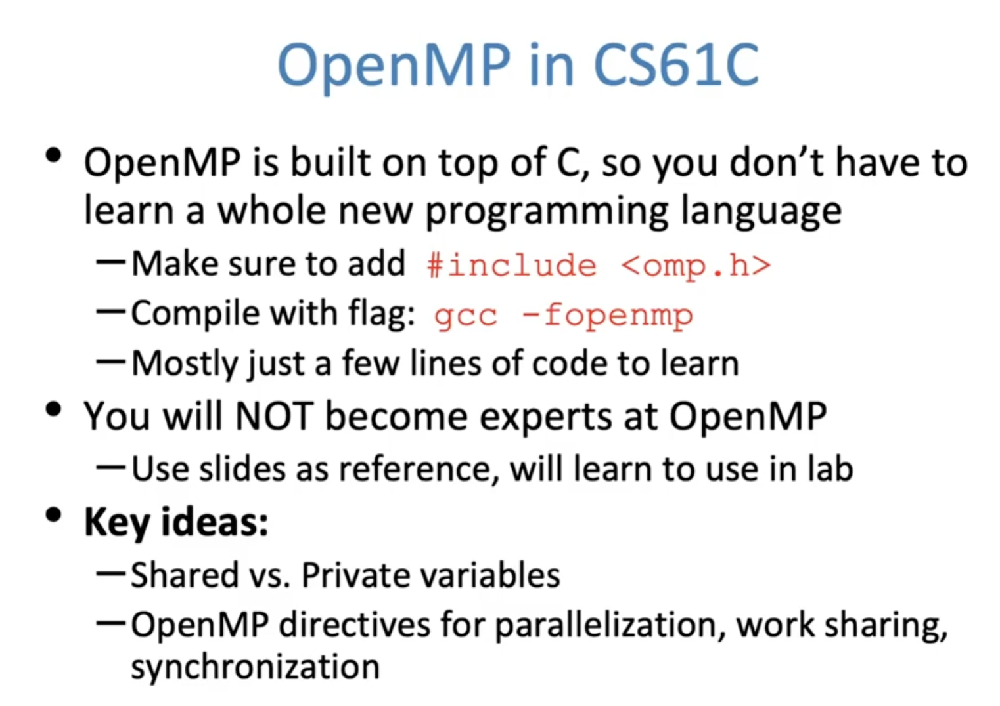
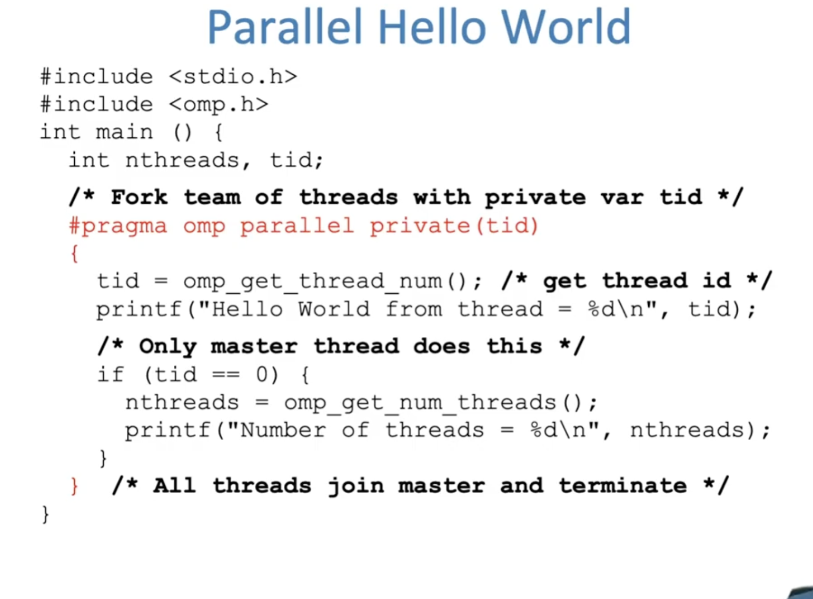

# Amdahl's Law & TLP: Review & Intro


- Methods to increase performance
  - Momain-Specific Hardware
  - Parallelism!!
    - Instruction-Level Parallelism
    - Data-Level Parallelism 
    - Thread-Level Parallelism
    - Request-Level Parallelism32`

**Program**

- Compiled, assembled and linked code that's ready to be loaded and run 

Process 

- A program that's currently running (on a "processor")
- Has a PC and a memory space


**Multiprocessor Systems**

A computer system with at least 2 processors or cores 

- Each core has its own PC and registers
- Each core executes independent instruction streams
- Processors share the same system memory 
- Communication through loads and stories to a common location 


Multithreading vs. Multicore

- Multithreading => Better Utilization 
  - 5% more hardware, 1.3X better performance?
  - Share integer adder, floating point adders, caches (L1 I, L1 D, L2 cache, L3 cache), Memory Controller 
- Multicore => Duplicate Processors
  - 50% more hard ware,  2X better performance
  - Share some caches (L2, L3), Memory Controller 
- Modern machines do both
  - Multiple cores with multiples threads per core

## Parallelism Challenged

**Amdahl's Law**



**Data Races**

Not writing to the same memory address

**synchronizing** writing and reading to get deterministic behavior




## Synchronization

Lock Synchronization 

- Use a "Lock" to grant access to a region (critical section) so that only one thread can operate at a time
  - Need all processors to be able to access the lock, so use a location in shared memory as the lock 
- Processors read lock and either wait (if locked) or set lock and go into critical section 
  - 0 means lock is free / open / unlocked / lock off
  - 1 means lock is set / closed / locked / lock on 

```
Check lock
Set the lock
Critical section
(e.g. change shared variables)
Unset the lock
```

 




## OpenMP









## OpenMP Work Sharing 