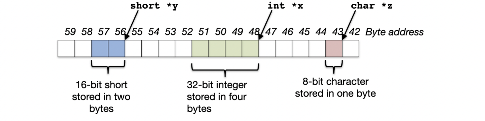
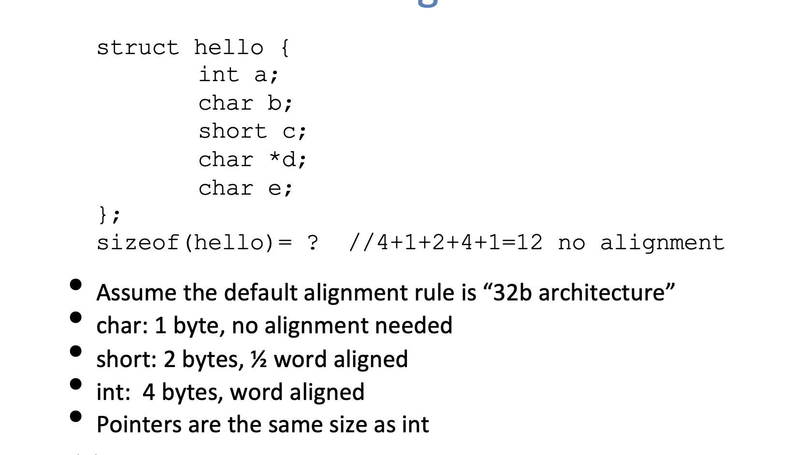
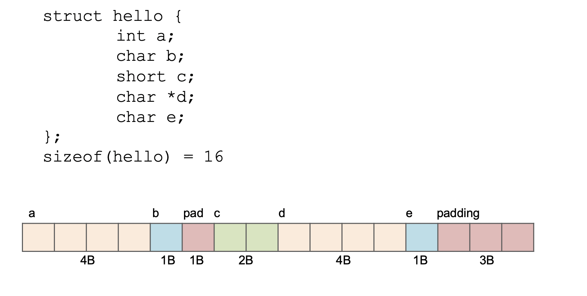
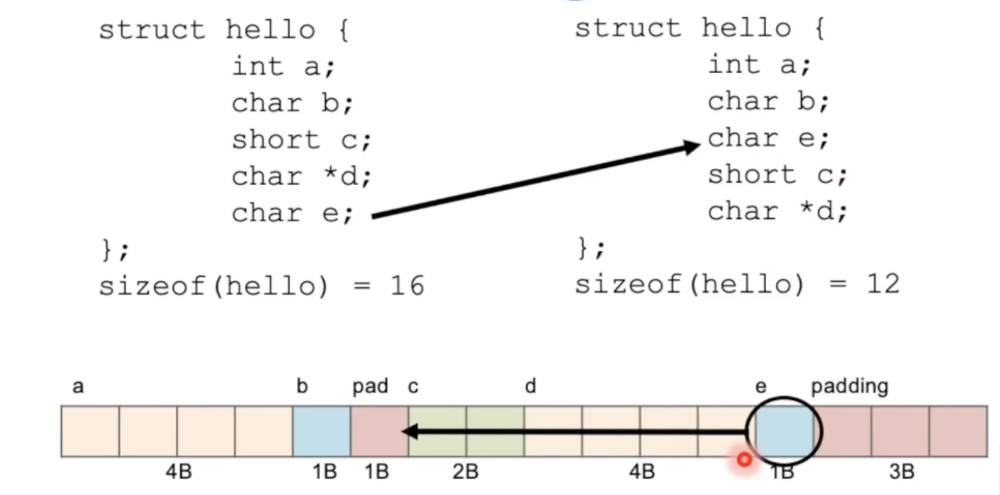
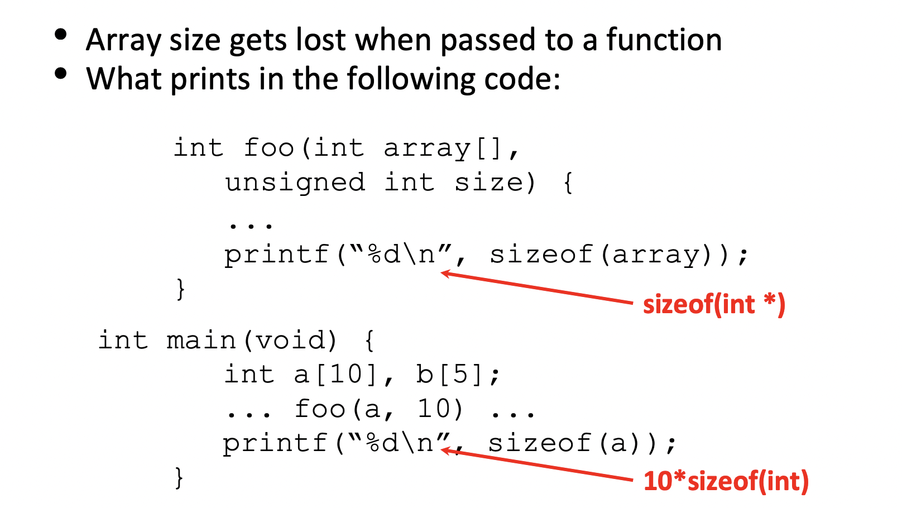

# Arrays

**Pointing to Different Size Objects**

- we actually want "word alignment"

  - some processors will not allow you to address 32b values without being on 4 byte boundaries
  - Others will just be very slow if you try to access "unaligned" memory.

  

**Struct Alignment**

**Arrays and Functions**

