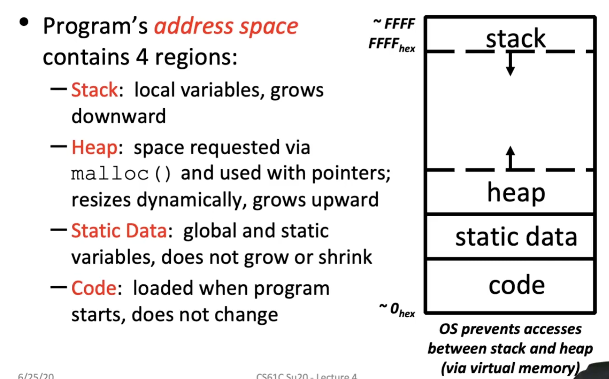
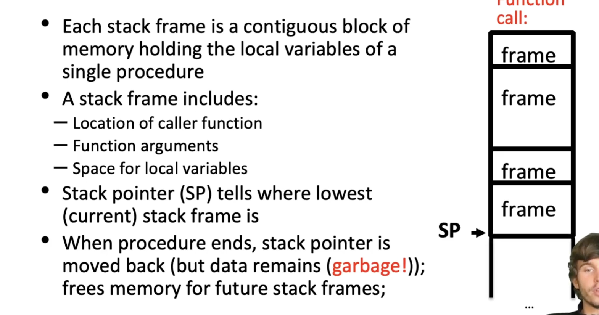
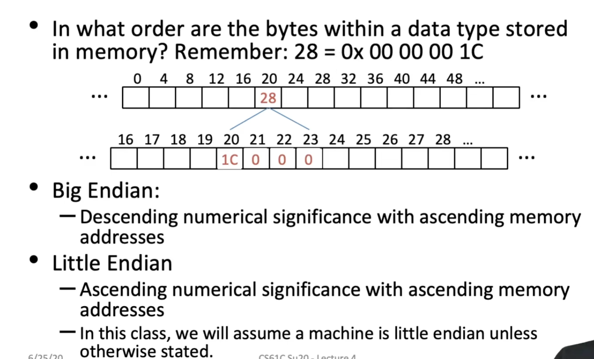
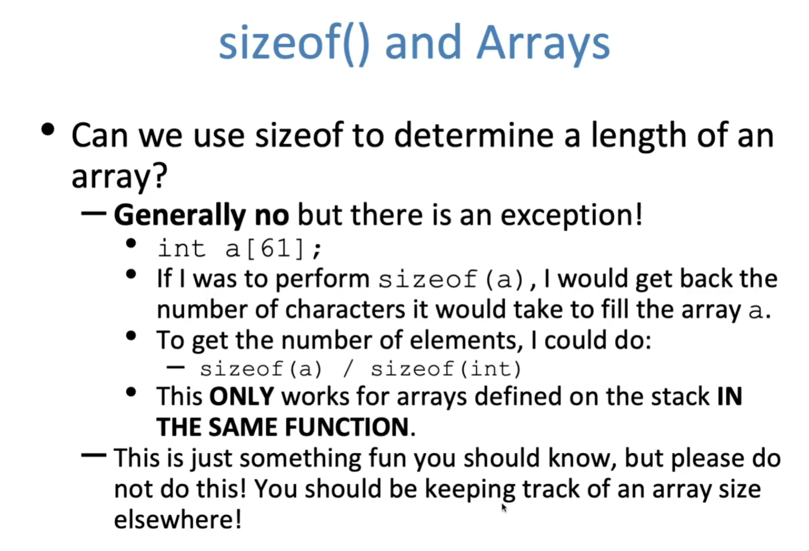
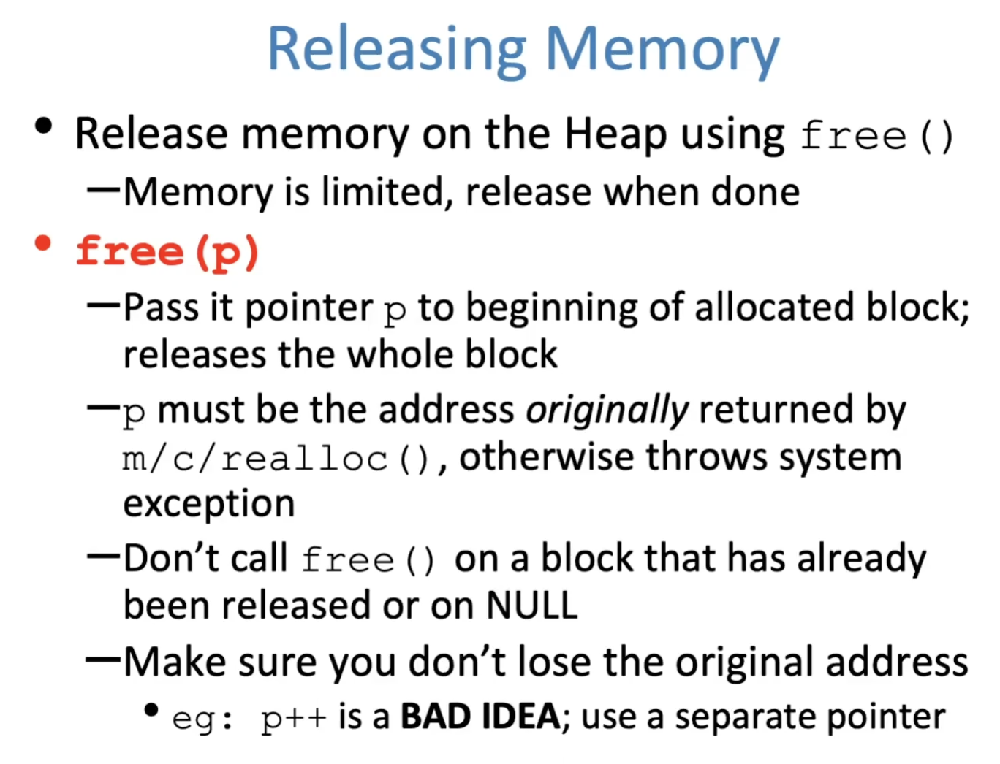
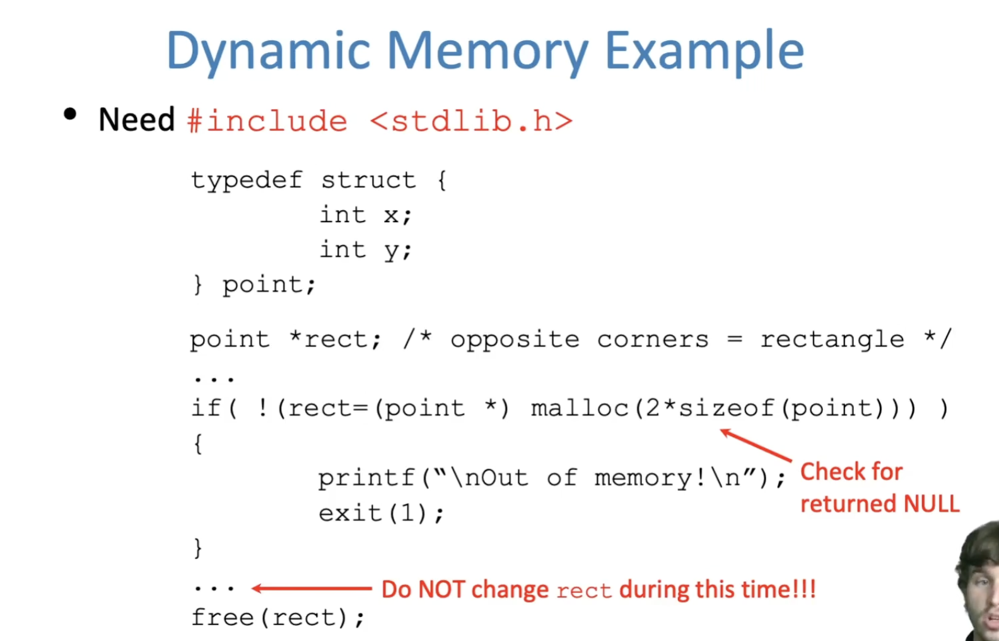

# C Memory Layout 



- Declared outside a function:

  Static Data

- Declared inside a funciton:

  Stack

  - main() is a function
  - Freed when funciton returns

- Dynamically allocated:

  Heap


**The Stack**



**Static Data**

Place for variables that persist

- Data not subject ot comings and goings like function calls
- Examples: String literals, global variables
- String literal example: char * str = "hi";
- Do not be mistaken with: char str[] = "hi"
  - This will put str on the stack!
- Size does not change, but sometimes data can
  - Notably string literals cannot 

# Addressing and Endianness

- The size of an address in bytes depends on architecuture (in this class we wiill assume a machine is a 32-bit machine unless told otherwise)

- if a machine is byte-addressed, then 

- Endianness

  

# Dynamic Memory Allocation



**Allocating Memory**

- 3 functions forrequesting memory:

  malloc(), calloc(), and realloc()

- **malloc(n)**

  - Allocates a continuous block of n bytes of uninitialized memory (contains garbage!)
  - Returns a pointer to the beginning of the allocated bolock; NULL indicates failed request 
  - Different blocks not necessarily adjacent

```c
int *p = (int*) malloc(n * sizeof(int));
free(p)
```



- **Calloc**

  void *calloc(size_t nmemb, size_t size) 

  - Like malloc, except it initializes the memory to 0
  - nmemb si the number of members
  - size is the size of each member
  - ex: int *p = (int *) calloc(5, sizeoof(int));

- **Realloc**

  - What happens when i need more or less memory in an array
  - void *realloc(void *ptr, size_t size)
    - Takes in a ptr that has been the return of malloc/calloc/realloc and a new size
    - Returns a pointer with now size space (or NULL) and copies any contents from ptr
  - Realloc can move or keep the address the same 
  - Do not rely on old ptr values




