## Floating Point

- How do we encode the following:
  - Real numbers (3.14159)
  - Very large numbers (6.02 * 10^23)
  - Very small numbers (6.626*10^-34)
  - Special numbers (infinite, nan)

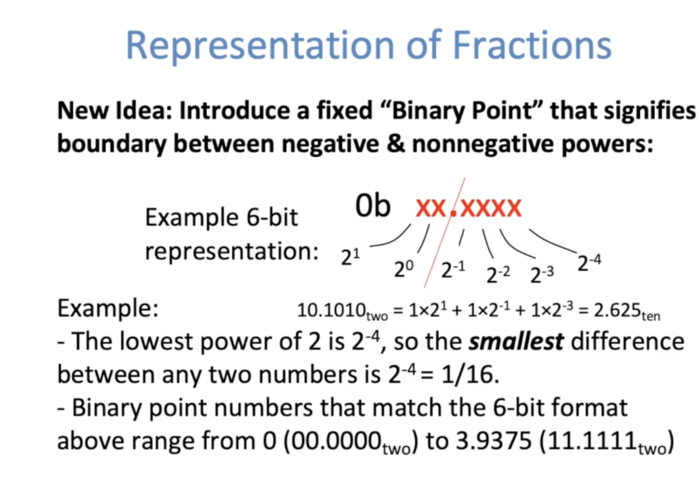

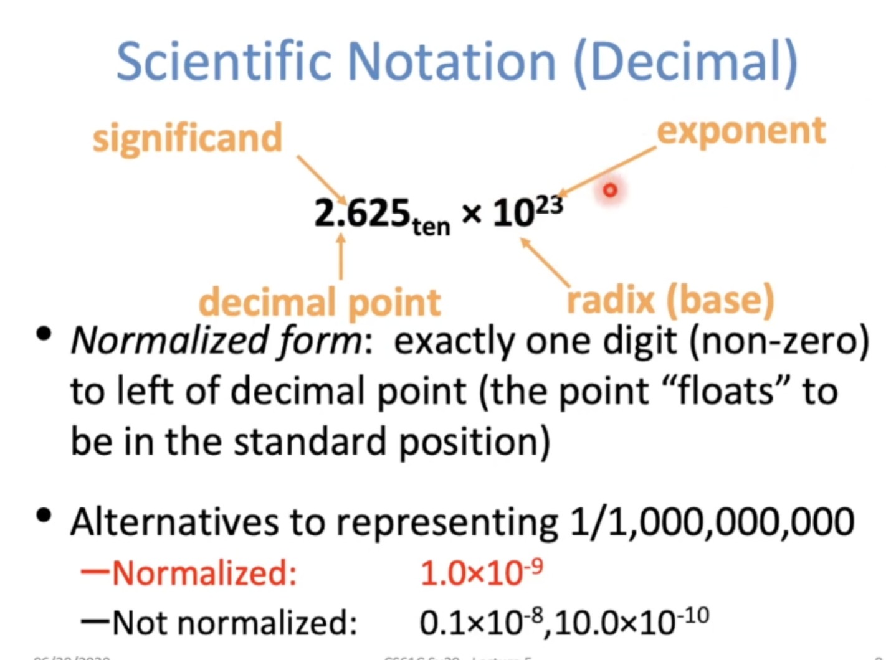

Computer arithmetic that supports this called floating point due to the "floating" of the binary point

**IEEE Standard 754 for Binary Floating -Point Arithmetic**

### Floating Point Encoding: Single Precision 

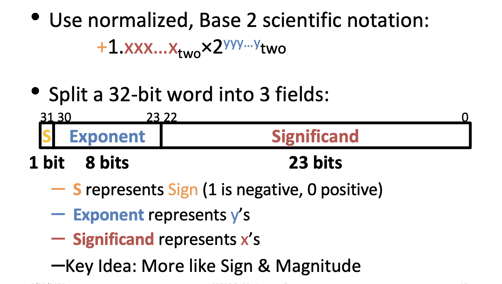

**The Exponent Field**

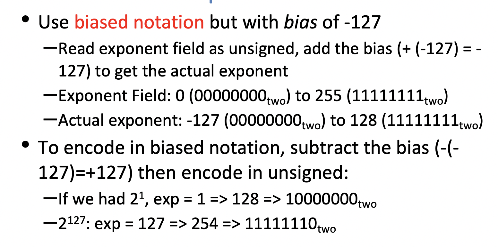

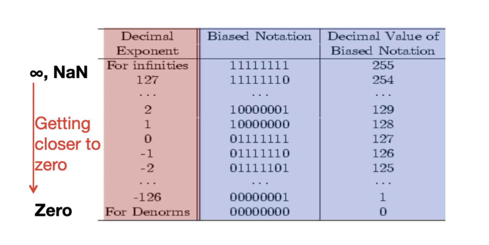

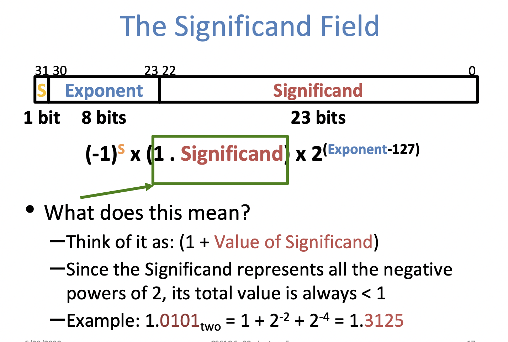

 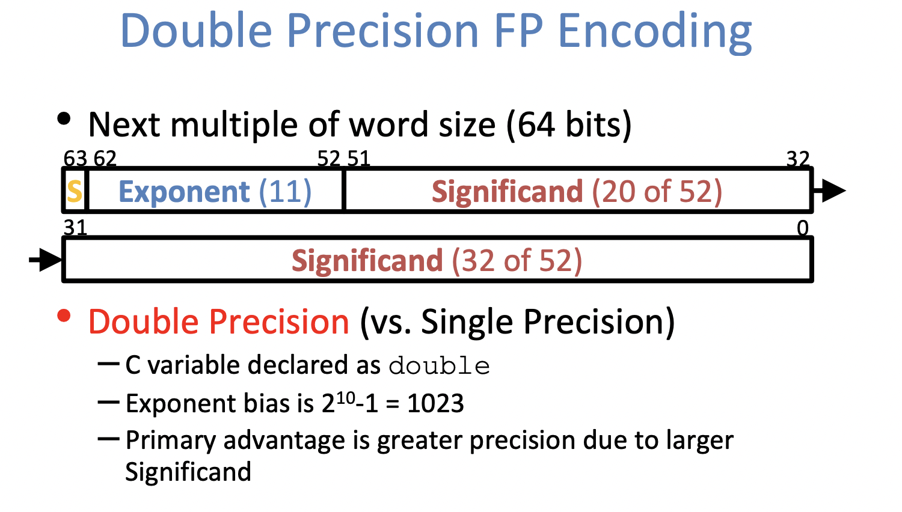

## Floating Point Special Cases

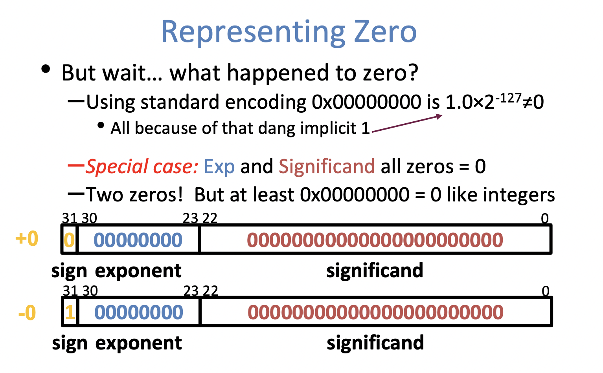

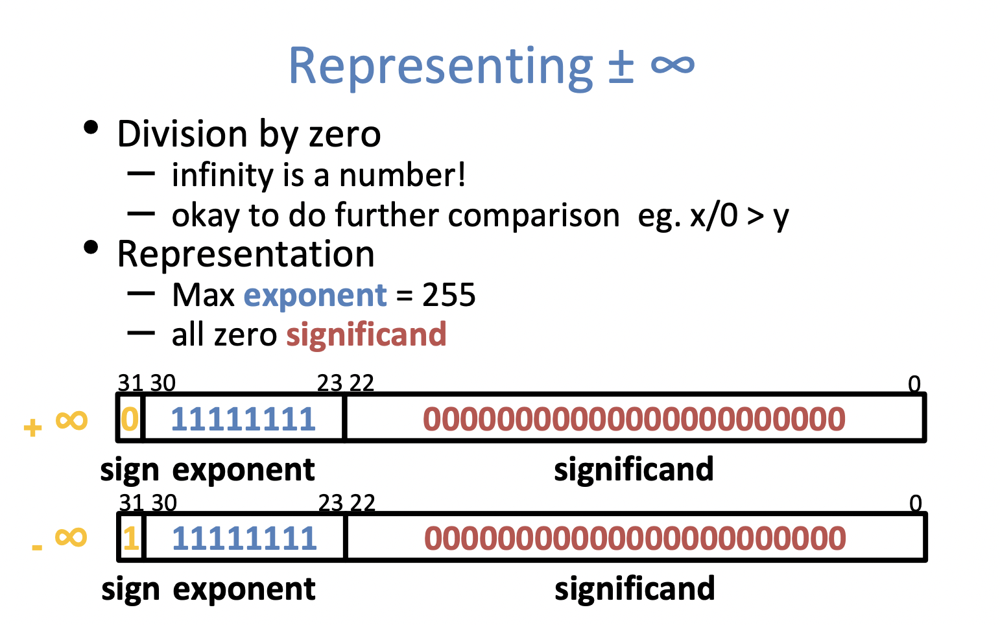

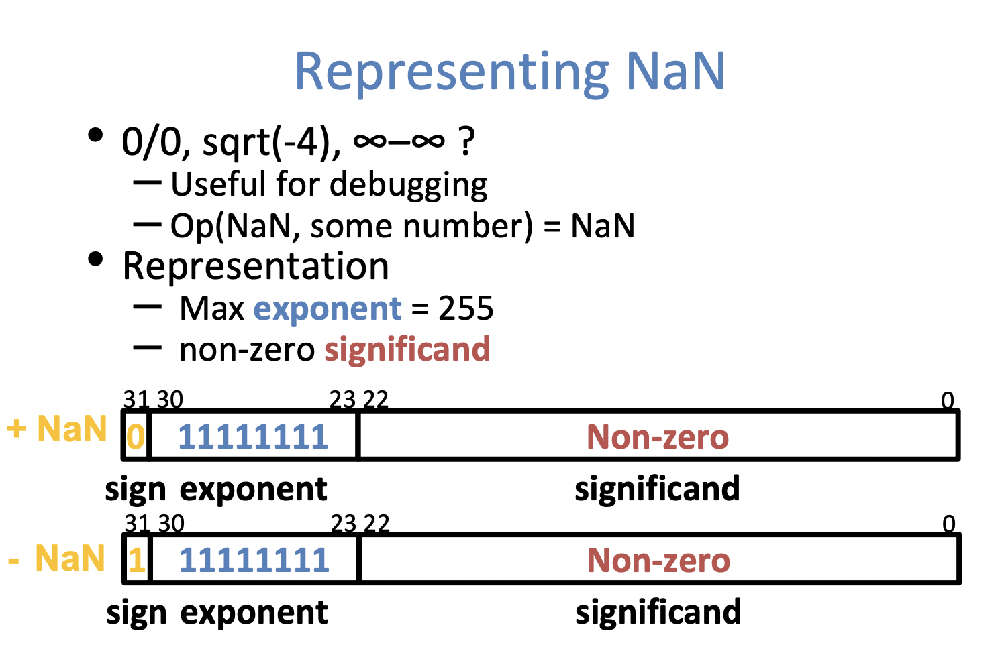

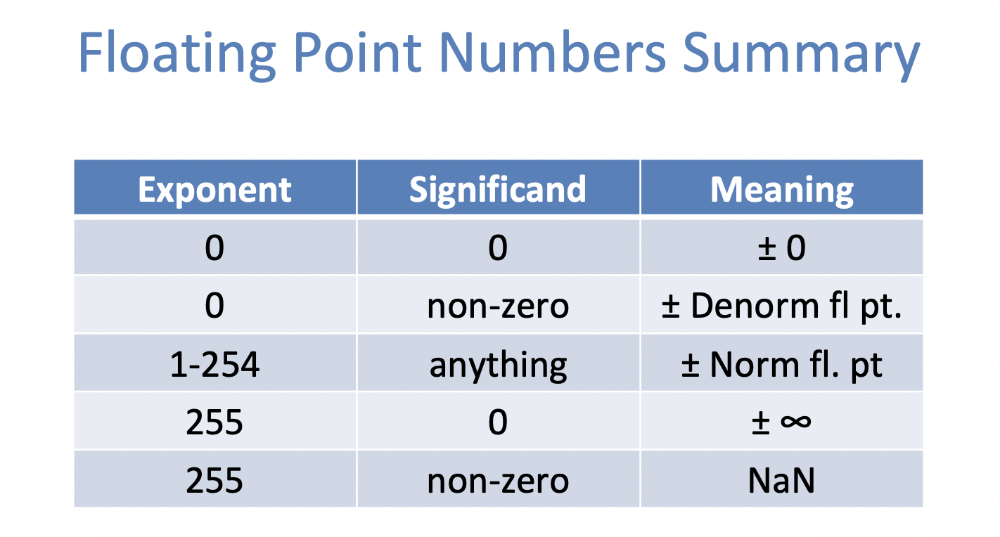

## Floating Point Limitations

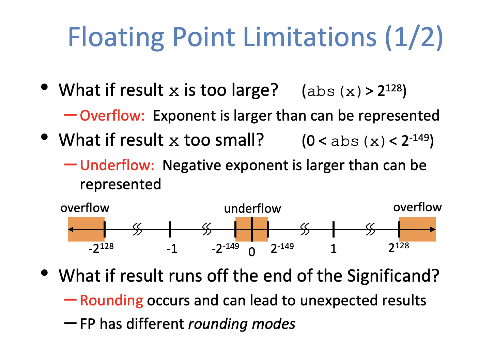

