## Background

**Mainstream Instruction Set Architectures**

- x86
- ARM architectures
- RISC-V

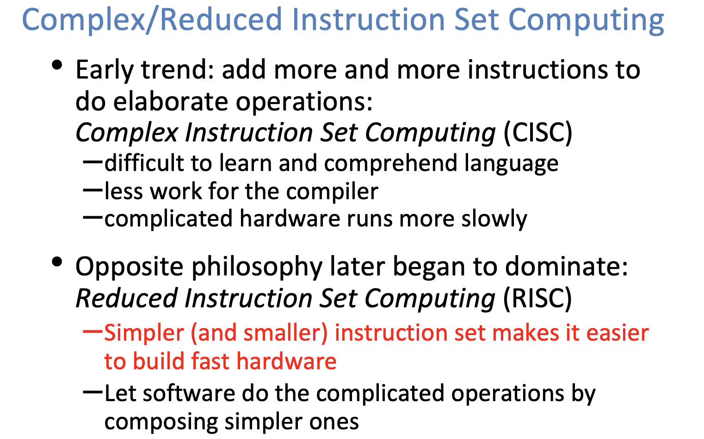


RISC-V Resources Full RISC-V Architecture http://digitalassets.lib.berkeley.edu/techreports/ucb/text/EECS-2016-1.pdf 

Everything we need for CS61C https://inst.eecs.berkeley.edu/~cs61c/fa17/img/riscvcard.pdf (“Green Card”)

## Registers

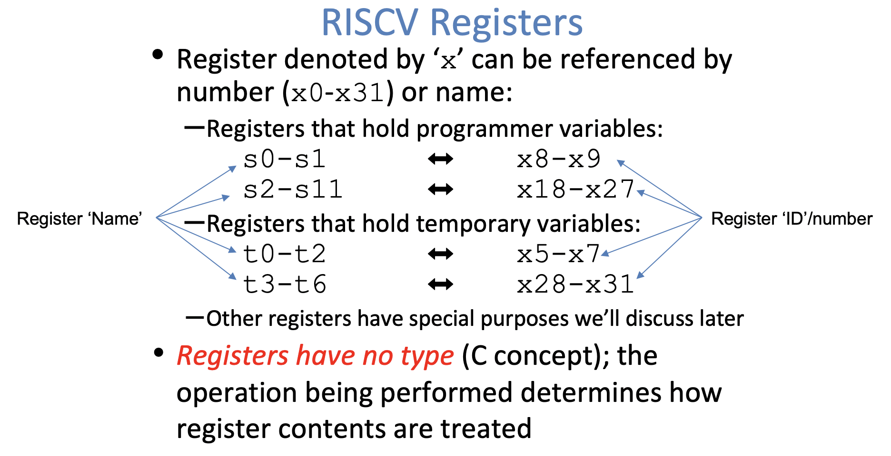

**A Special Register**

The zero register

- Zero appears so often in code and is so fusel that it has its own register!

- Register zero (x0 or zero) always has the value 0 and cannot be changed!

  Any instruction writing to x0 has no effect

## Assembly Code

Instruction Syntax is rigid:

`op dst, src1, src2`


## Basic Arithmetic Instructions

```assembly
# a = b + c
add s1, s2, s3
# a = b - c
sub s1, s2, s3
```


## Immediate Instructions

Numerical constants are called `immediates`

Separate instruction syntax for immediates:

`opi dst, src, imm`

```assembly
addi s1, s2, 5 # a = b + 5
addi s3, s3, 1 # c++
```


## Data Transfer Instructions

Instruction syntax for data transfer:

`memo reg, off(bAddr)`

- `Address` = register with pointer to memory ("base address")
- `off` =  address offset (immediate) in bytes ("offset")

Access memory at address `bAddr + off`

**Reminder**: A register holds a word of raw data (no type) - make sure to use a register (and offset) that point to a valid memory address


**Memory is Byte-Addressed**

- Memory addresses are indexed by *bytes*, not words
- Word addresses are 4 bytes apart 
  - Word addresses is same as first byte
  - Address must be multiples of 4 to be "word-aligned

```assembly
# array[10] = array[3] + b
lw t0, 12(s3)  # t0=A[3]
add t0, s2, t0 # t0=A[3]+b
sw t0, 40(s3)  # A[10]=A[3]+b
```


**Values can start off in memory**

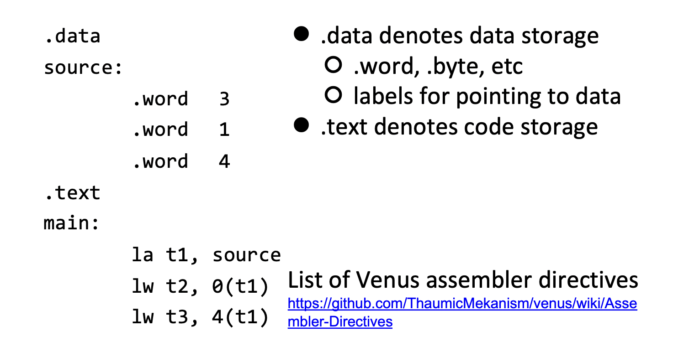

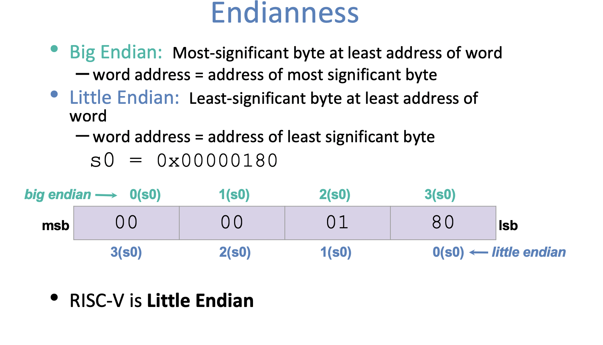


**Sign Extension**

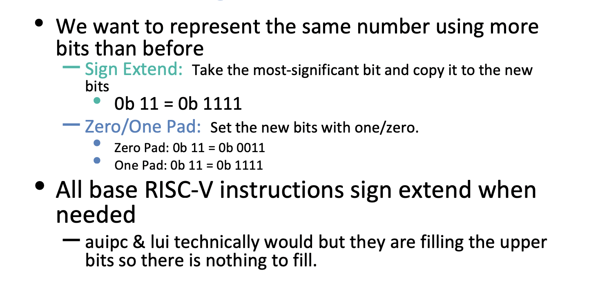


**Byte Instructions**

- Lb/sb utilize the *least significant byte of the register* 
  - On `sb`, upper 24 bits are ignored
  - On `lb`, upper 24 bits are filled by sign-extension

**Half-Word Instructions**

- On `sh`, upper 16 bits are ignored
- On `lh`, upper 16 bits are filled by sign-extension

**Unsigned Instructions**

- `lhu` "load half unsigned"
- `lb` "load byte unsigned"

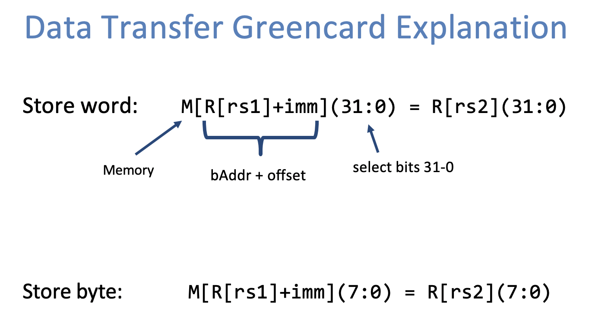

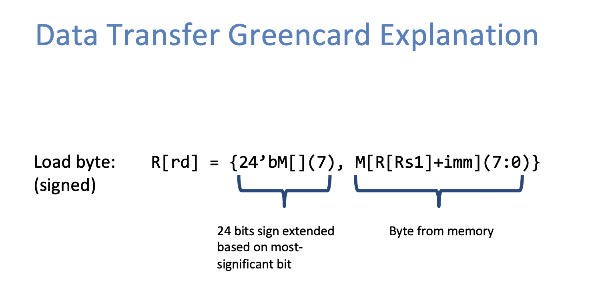


## Control Flow Instructions

**Decision Making Instructions**

```assembly
# Branch If equal (beq)
beq reg1, reg2, label

# Branch If Not Equal (bne)
bne reg1, reg2, label

# Jump(j)
j label
```

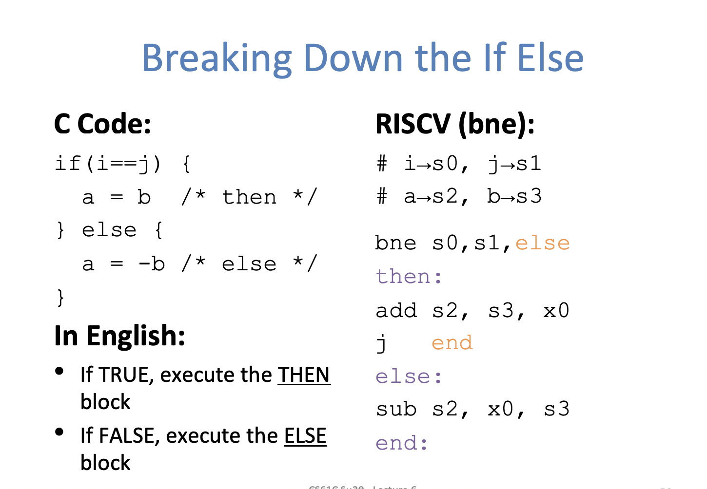

```assembly
# Branch Less Than (blt)
blt reg1, reg2, lable

# Branch Greater Than or Equal (bge)
bge reg1, reg2, label
```


**Program Counter**

- Branches and Jumps change the flow of execution by modifying the Program Counter (PC)
- The PC is a special register that contains the current address of the code that is being executed 

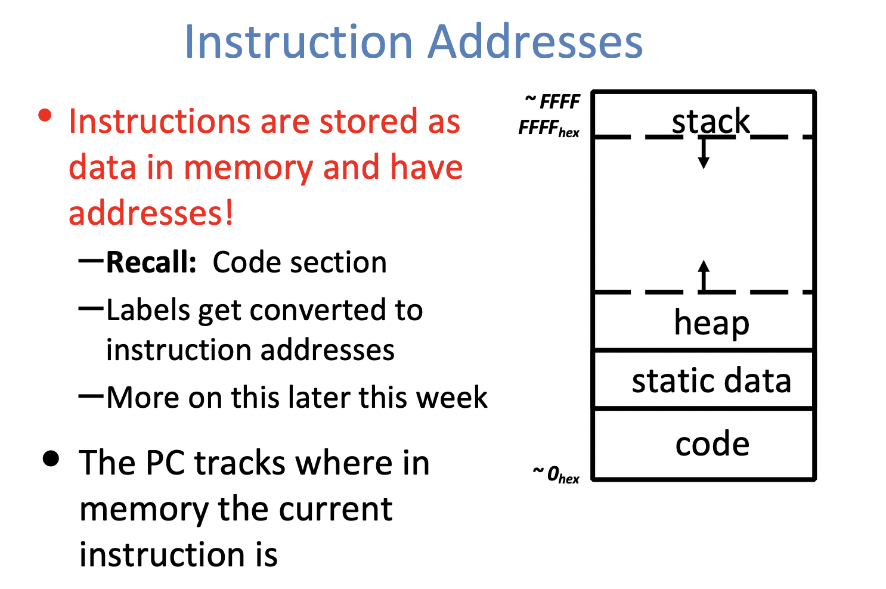

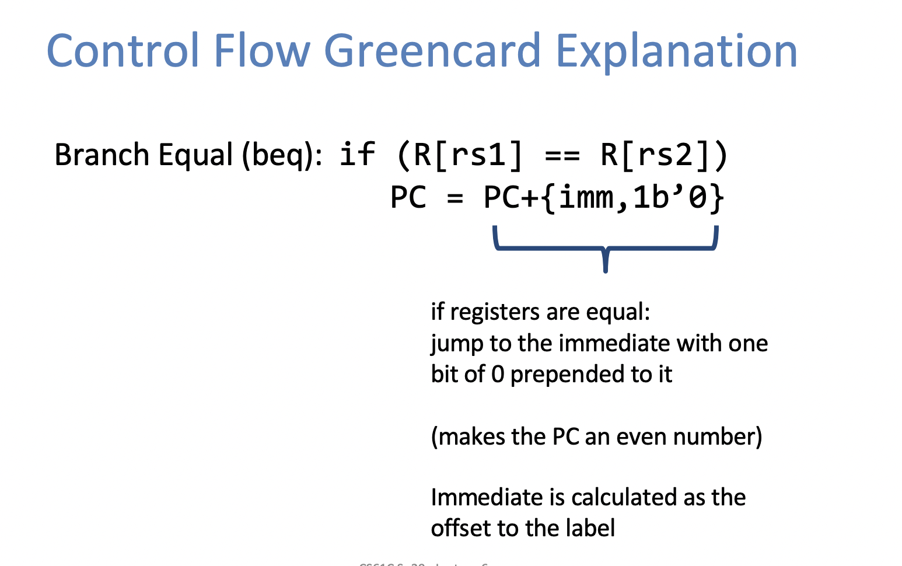


## Shifting Instructions

- Logical shift: Add zeros as you shift
- Arithmetic shift: Sign-extend as you shift 

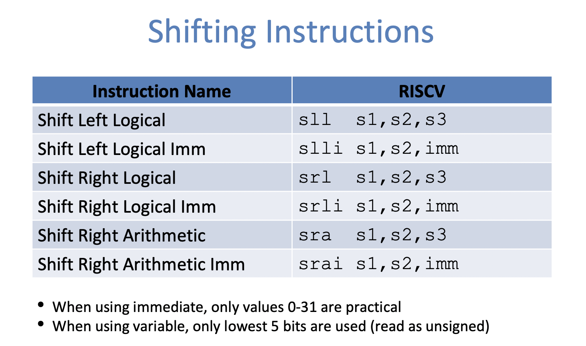


# Other useful Instructions 

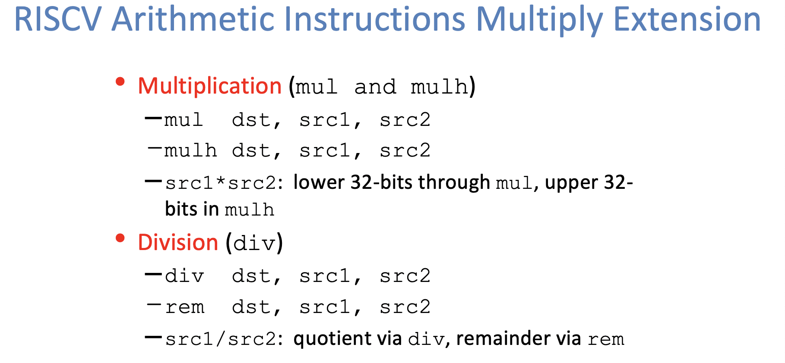

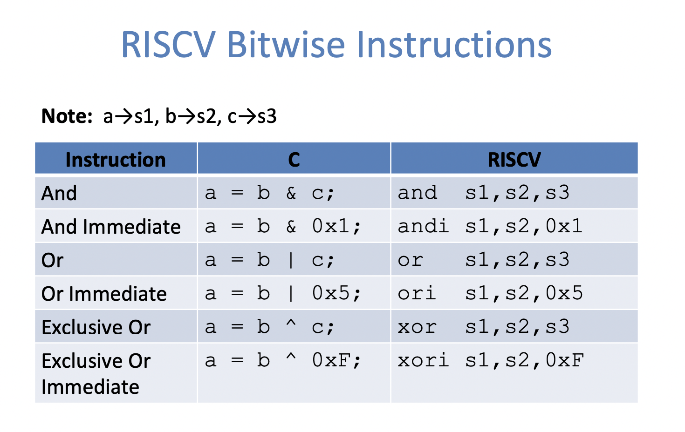

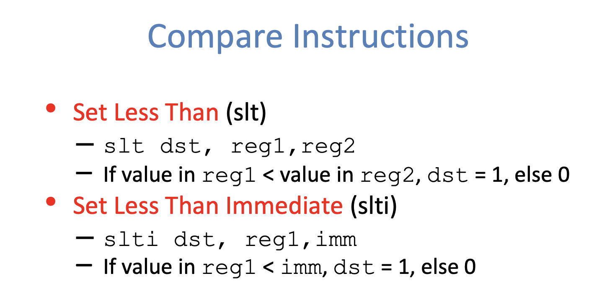

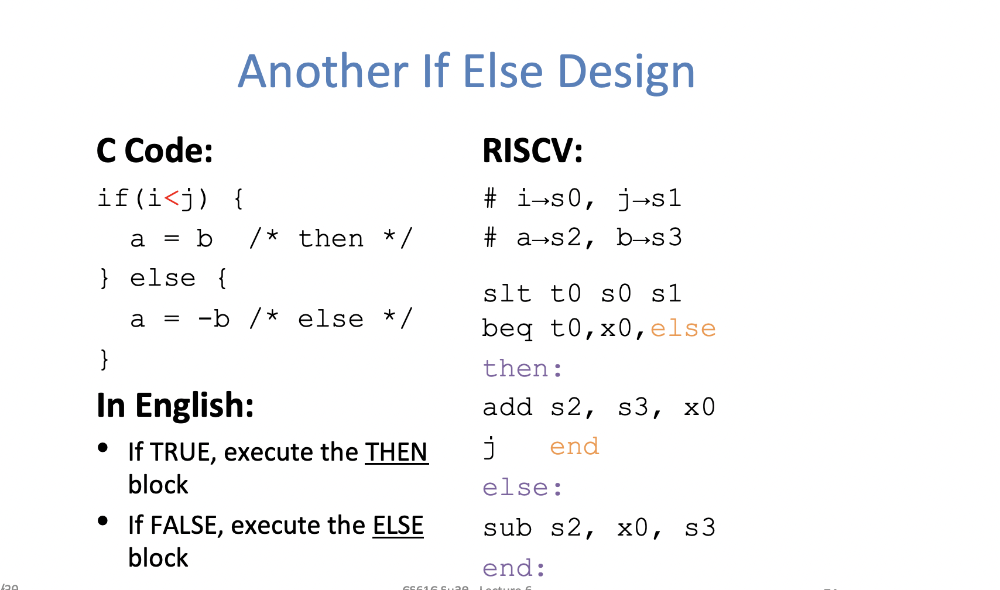

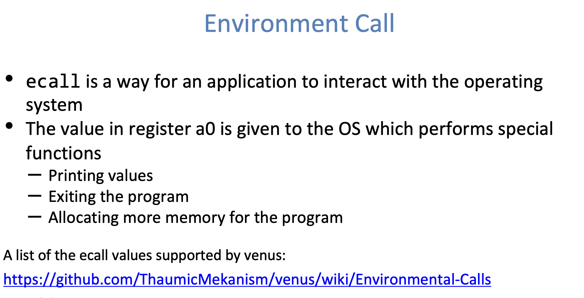