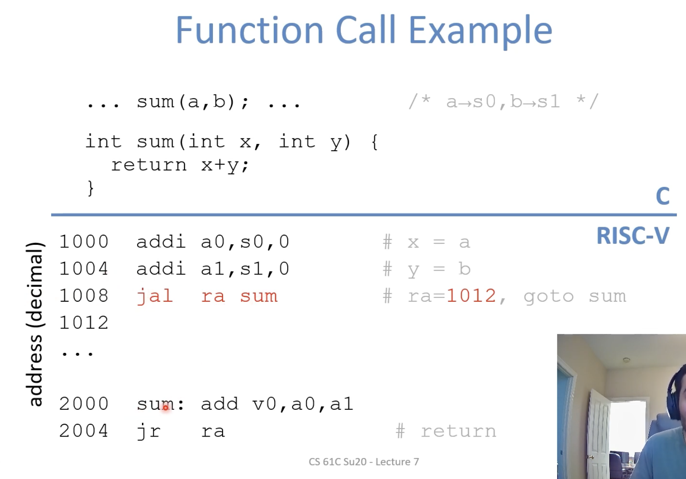

**RISC Design Principles**

- Smaller is faster: 32 registers, fewer instructions
- Keep it simple: rigid syntax

**RISC-V Registers**

- S0 - s11
- T0 - t6
- x0


## Pseudo-Instructions

Sometimes, for the programmer's benefit, it's useful to have additional instructions that aren't really implemented by the hardware

```assembly
mv dst, reg1
addi dst, reg1, 0
```


## C to RISC-V Practice


## Functions in Assembly 

Six Steps of Calling a Function 

1. Put arguments in a place where the function can access them 
2. Transfer control to the function
3. The function will acquire any (local) resources it needs
4. The function performs its desired task
5. The function puts return value in an accessible place and "cleans up"
6. Control is returned to you


**Where should we put the arguments and return values?**

- Registers way faster than memory, so use them whenever possible 
- `a0-a7`: eight argument registers to pass parameters 
- `a0-a1`: two argument registers also used to return values 
  - Order of arguments matters
  - If need extra space, use memory (the stack!)





**Local storage for variables**

```assembly
# store t0 to the stack
addi sp, sp, -4
sw t0, 0(sp)
```


## Function Calling Conventions

**Which registers can we use?**

Problem: how does the function know which registers are safe to use?

Call another function in a function will overwrite `ra`, so we must save it.

**Calling Convections**

- CalleR: the calling function
- CalleE: the function being called
- Register Conventions: A set of generally accepted rules as to which registers will be unchanged after a procedure call and which may have changed


**Saved Registers**

- `s0-s11` (saved registers)
- `sp (stack pointer)` 


**Volatile Registers (Caller Saved)**

These register can be freely changed by the calledE

- T0-t6
- a0-a7
- ra

 


**Summary**

