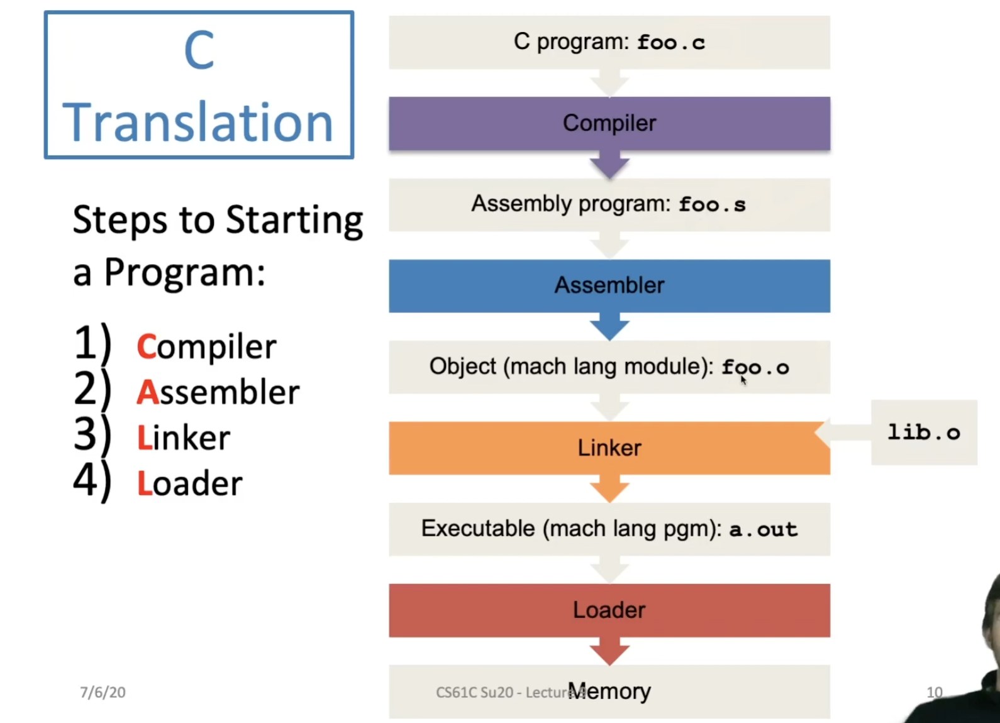

## Compiler

- Input: Higher-level language (HLL) code 
- Output: Assembly Language Code
- Note that the output may contain pseudo-instructions
- In reality, there's a preprocessor step before this to handle #directives but it's not very exciting

## Assembler

- Input: Assembly language code
- Output: Object code
- Read and uses directives
- Replaces pseudo-instructions
- Produces machine language

**Assembler Directives**

- .text: Subsequent items put in user text segment
- .data: Subsequent items put in user data segment
- .globl sum: declares sim global and can be referenced from other files
- .asciiz str: Store the string str in memory and null-terminates it 
- .word w1...wn: Store the n 32-bit quantities in successive memory words

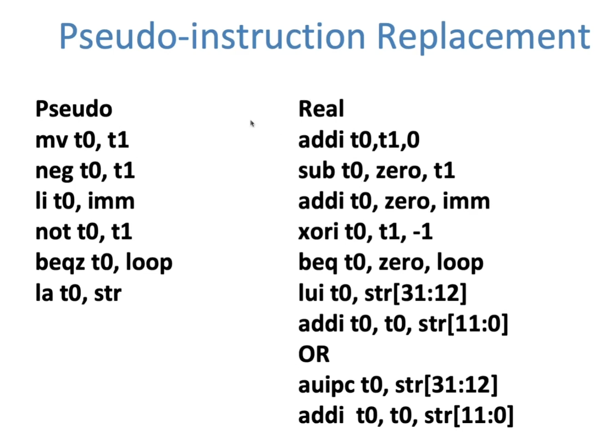

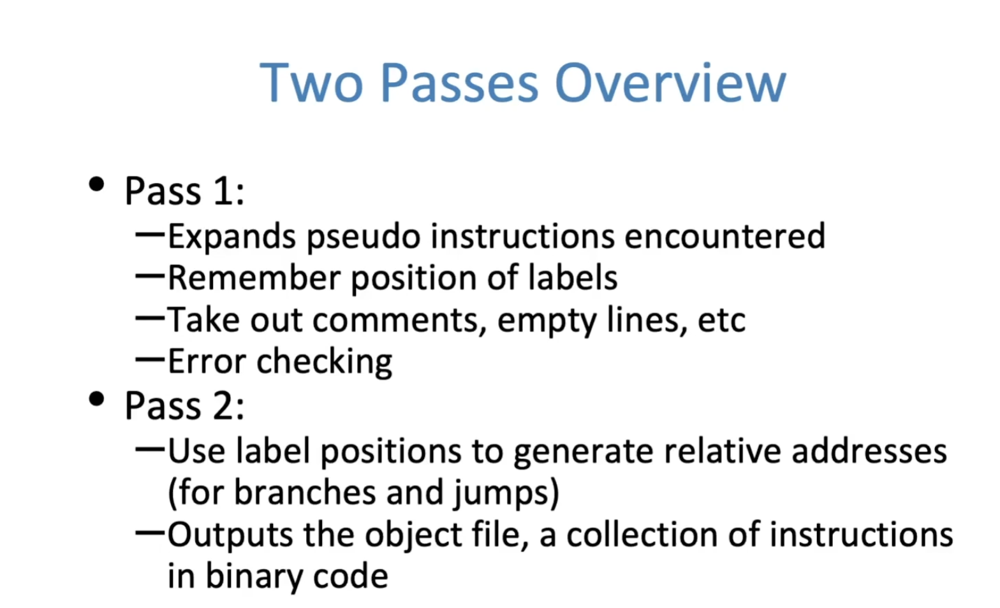

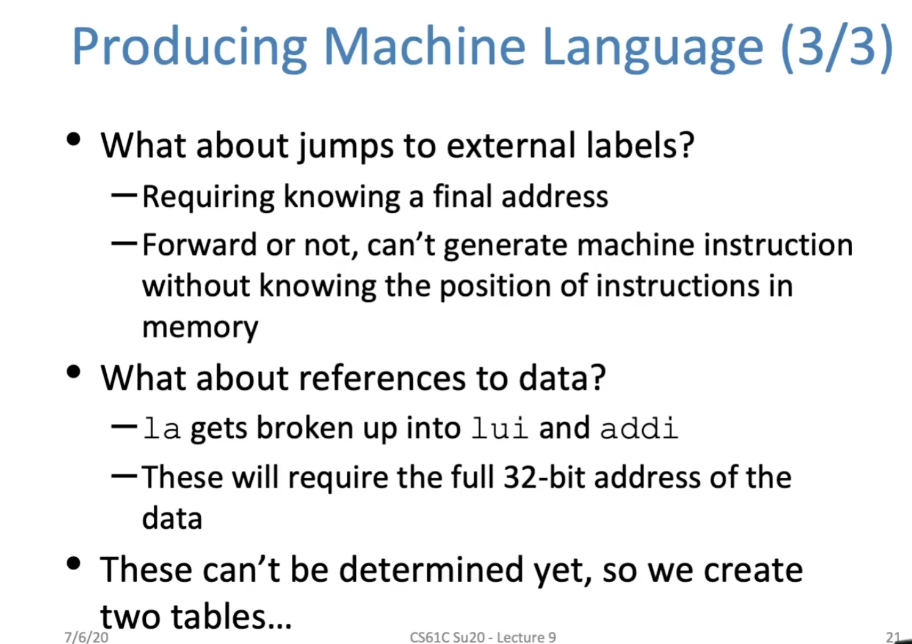

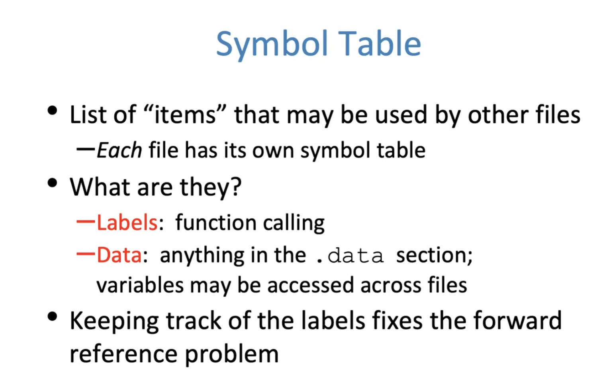

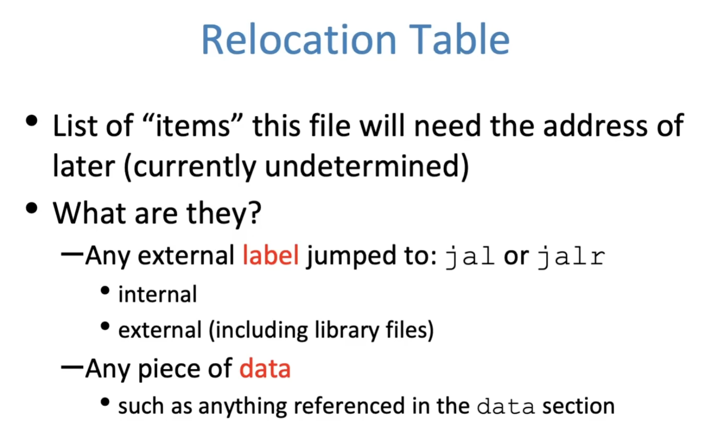

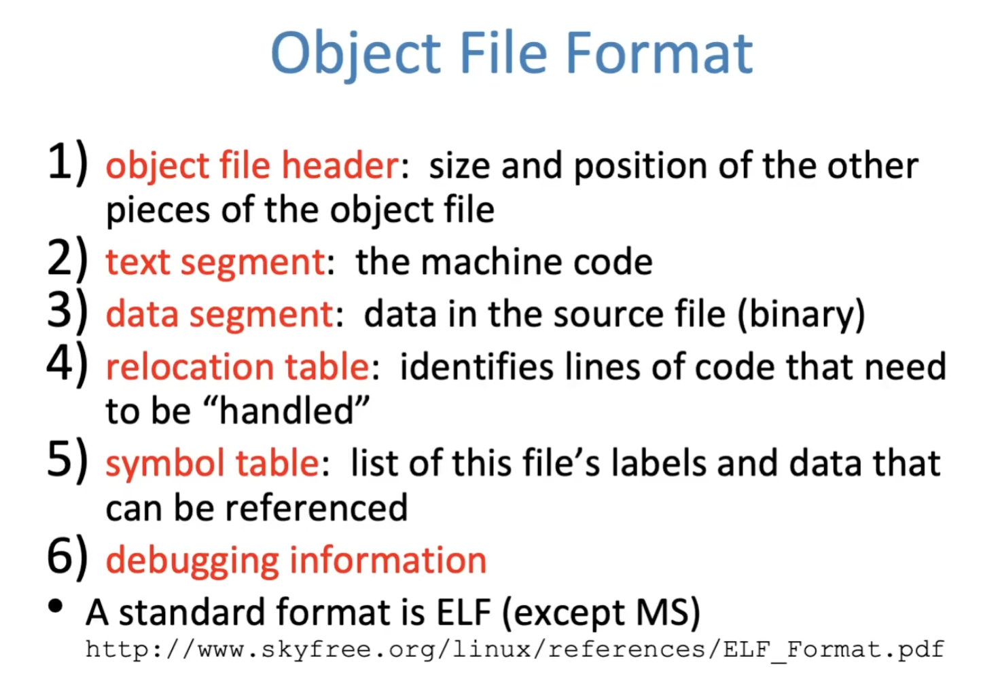

## Linker

- Input: Object Code files, information tables
- Output: Executable Code
- Combines several object files into a single executable
- Enables separate compilation of files
  - Changes to one file do not require recompilation of whole program
  - Old name "Link Editor" from editing the "links" in jump and link instructions

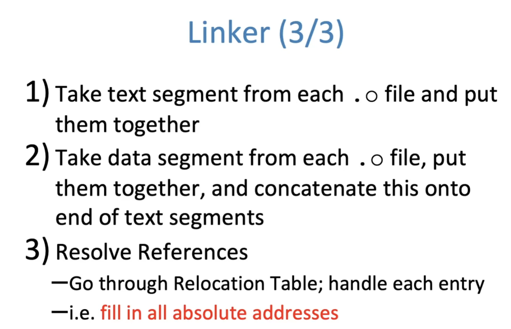

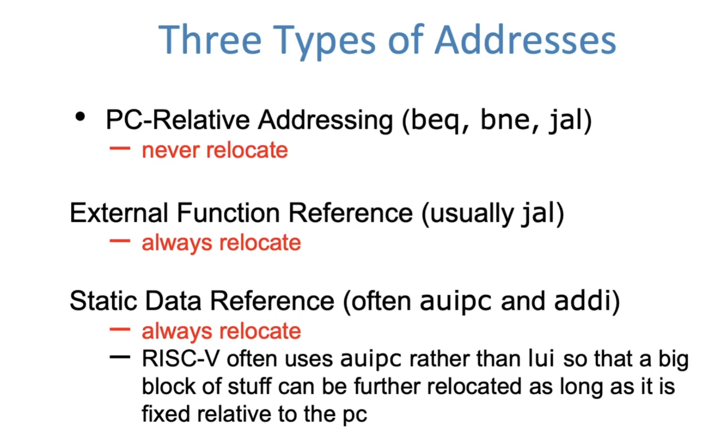

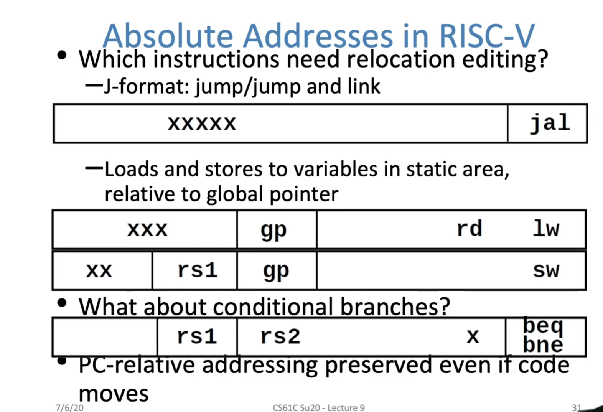

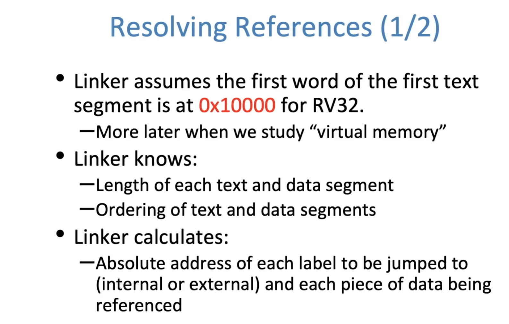

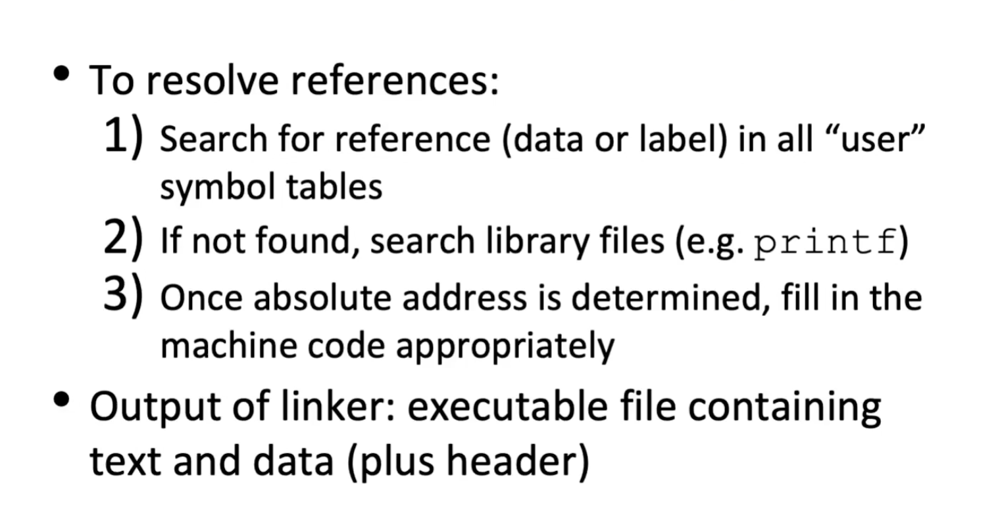

## Loader

- Input: Executable Code
- Output: <program is run>

1) Reads executable file's header to determine size of text and data segments
2) Creates new address space for program large enough to hold text and data segments, along with a stack segment
3) Copies instructions and data from executable file into the new address space
4) Copies arguments passed to the program onto the stack
5) Initializes machine registers
   1) Most registers cleared, but stack pointer assigned address of 1st free stack location
6) Jumps to start-up routine that copies program's arguments from stack to register and sets the PC
   1) If main routine returns, start-up routine terminates program with the exit system call

 